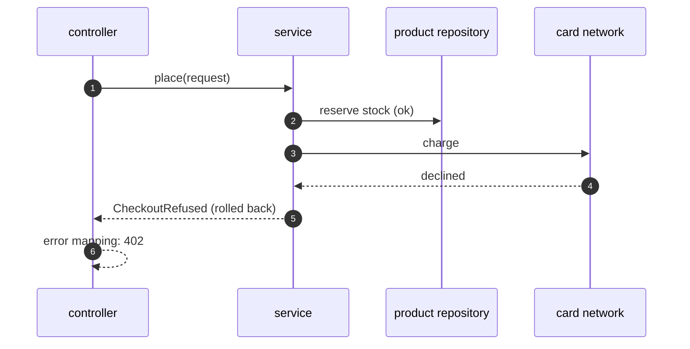

# Layered Architecture with Spring Boot Pattern — Sequence Diagram

Written for a listener with the screen off.

Say it in words. The controller receives the request and calls the service. The service opens a transaction and asks the product repository to reserve the stock, which succeeds. It asks the card network to charge, and the card is declined. The service turns that into a checkout refusal, the transaction rolls back and the stock is restored. The error mapping class turns the refusal into a four oh two.

Mermaid source

The load-bearing sentence: **the transaction belongs to the layer that knows the whole use case.**
