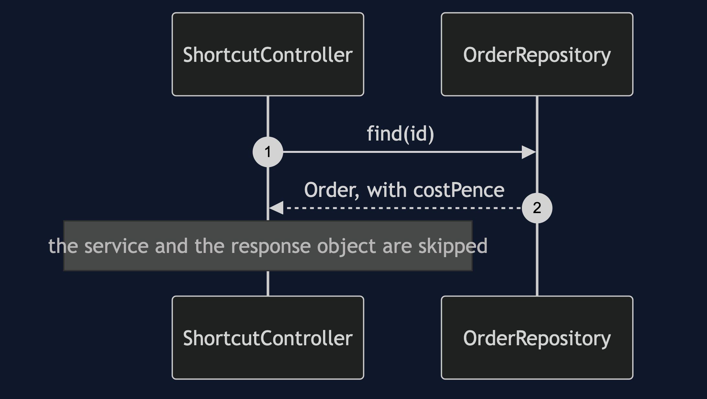
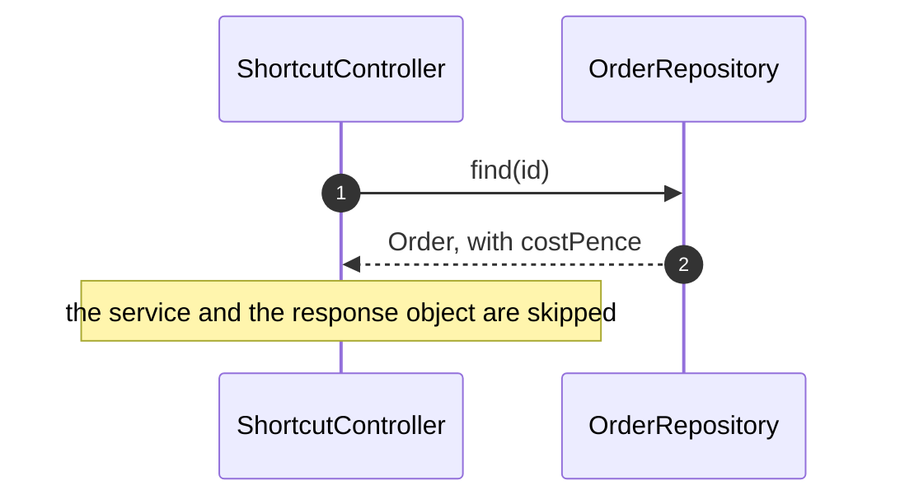

# Layered Architecture with Spring Boot Pattern — UML Sequence Diagrams

Four sequences.

## 1. The Shortcut

Mermaid source

```mermaid
sequenceDiagram
    autonumber
    participant C as ShortcutController
    participant R as OrderRepository
    C->>R: find(id)
    R-->>C: Order, with costPence
    Note over C: the service and the response object are skipped
```

