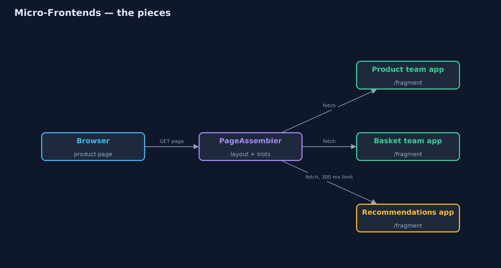
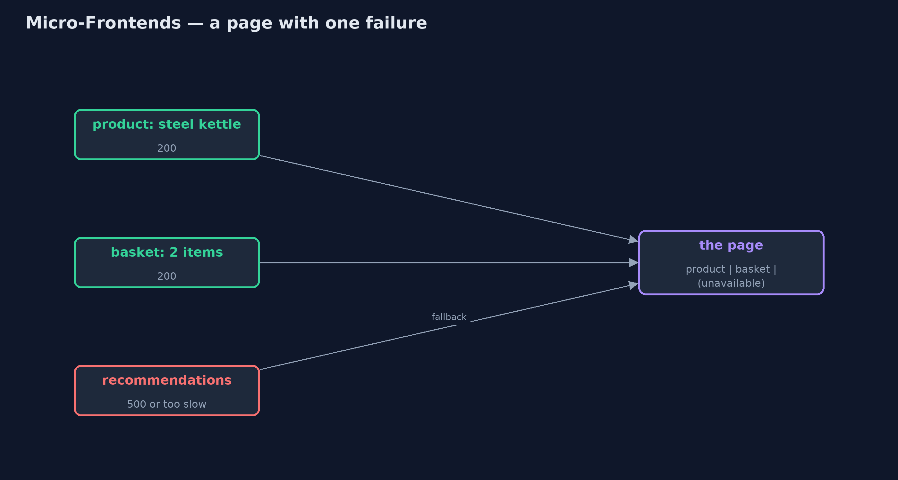

# Micro-Frontends Pattern

```
src/main/java/com/jk/explore/microfrontends/
├── MicroFrontendsDemo.java  The five acts: one front-end for everything, a page assembled from team fragments, a failing fragment, an independent release, and the bill
├── OneFrontEnd.java         Without the pattern: one front-end application renders every part of the product page, and fails as one
├── PageAssembler.java       The pattern: the page is a layout with slots; each slot is filled by fetching a fragment from the team that owns it
└── TeamApp.java             One team's own small web application, serving just its fragment of the page
```

**Split a web page into parts owned by different teams, let each team build and release its part on its own, and assemble the page from those parts, with a fallback when one fails.**

Micro-frontends apply the idea of microservices to the part of a web site
people see. A page is split into parts, such as the product details, the
basket and the recommendations, and each part belongs to one team. Each team
builds, tests and releases its part as its own small application. The page
itself is a layout with slots, and each slot is filled by fetching that team's
fragment, either on the server, as here, or in the browser.

A bug or an outage in one team's fragment affects only its slot, and each team
releases when it is ready. The price is more requests per page and the work of
keeping the parts looking like one shop.

## The idea in everyday terms

Think of a newspaper. The sport desk, the business desk and the weather desk
each write their own pages, to their own deadlines. The printers put the
paper together from whatever each desk sends. If the weather desk is late,
the paper still goes out, with a note in the weather box. But if the desks
choose their own fonts, the paper starts to look like three different papers.

## The scenario

The online store's product page shows the product, a small basket summary and
recommendations. One front-end application rendered all of it, built by three
teams. When the recommendations team shipped a bug, the whole product page
failed, and fixing it meant releasing everyone's code together.

## Run

```bash
./gradlew run
```

The demo tells the story in 5 acts, each printing exact numbers that the tests check:

| Act | What it shows |
| --- | --- |
| 1. One front-end for everything | One application renders the product, basket and recommendations; a recommendations bug makes the whole page fail. |
| 2. Each team serves its part | Three team apps on their own servers serve fragments; the page is a layout with three slots. |
| 3. Failure stays in its slot | Recommendations fails, then is slow: its slot shows "recommendations unavailable" and the rest of the page is served. |
| 4. Independent releases | The basket team releases version 2 (free delivery over £40) without touching the other apps. |
| 5. The bill | One page view is 1 page + 3 fragment requests; the product team writes 30.00 GBP while the basket writes £38.00. |

## Test

```bash
./gradlew test
```

6 tests in `DemoRunsTest`, `PageAssemblerTest`. Every number the demo prints is asserted, and nothing depends on the clock, so every run gives the same result.

## Technologies and versions

| Technology | Version | Used for |
| --- | --- | --- |
| Java | 21 | the code (toolchain set in `build.gradle`) |
| Gradle | 9.2.1 (wrapper) | build and run, nothing to install |
| JUnit | 5.10.2 | the tests |
| videokit | repository tool | the narrated video and animation: Piper `en_US-amy-medium`, speed 0.8, longer pauses (the approved `amy-slow` voice) |

## Learning Material

| Document | What it is for |
| --- | --- |
| [Problem statement](docs/problem-statement.md) | the situation and what the project must show |
| [Prerequisites](docs/prerequisites.md) | what you need to know first |
| [Micro-Frontends, explained](docs/micro-frontends-pattern-explained.md) | the acts in prose |
| [Session guide](docs/session.md) | a one-hour lesson with exercises |
| [Animated walkthrough](docs/animation.html) | the acts step by step, narrated |
| [Spec](docs/spec.md) | what this project must be true of |

### The pattern in one picture

One layout, three team apps.



### Where each piece sits

An assembler and small team apps.


### How the data moves

Two fragments arrive; one slot gets its fallback.



### Who calls whom, in order

All fragments fetched at once.


### Video

`video/micro-frontends-pattern-explained.mp4` (with `.m4a` audio and `.srt` subtitles) is built by `video/build_video.sh`. Rendered media is not committed.

## What it costs

- **More requests.** One page view became one page and three fragment requests; the slowest fragment sets the page's pace.
- **Teams drift apart.** One team started writing "30.00 GBP" while another wrote "£38.00"; a shared design system is needed.
- **More to run.** Every team runs its own application, with its own monitoring.

## When this is too much

A site built by one team, or a few teams that release together happily, is
simpler as one front-end. Micro-frontends pay off when several independent
teams keep blocking each other's releases.

## Where you have already met this

- Server-side includes and edge-side includes (ESI) on CDNs.
- Module Federation in webpack, and single-spa, in the browser.
- Large shops and media sites where each team owns a part of the page.

## Where this sits

This project is in [architectural-design-patterns](..), next to
[Modular Monolith](../modular-monolith-pattern), which splits the back end by
team without splitting deployment.
