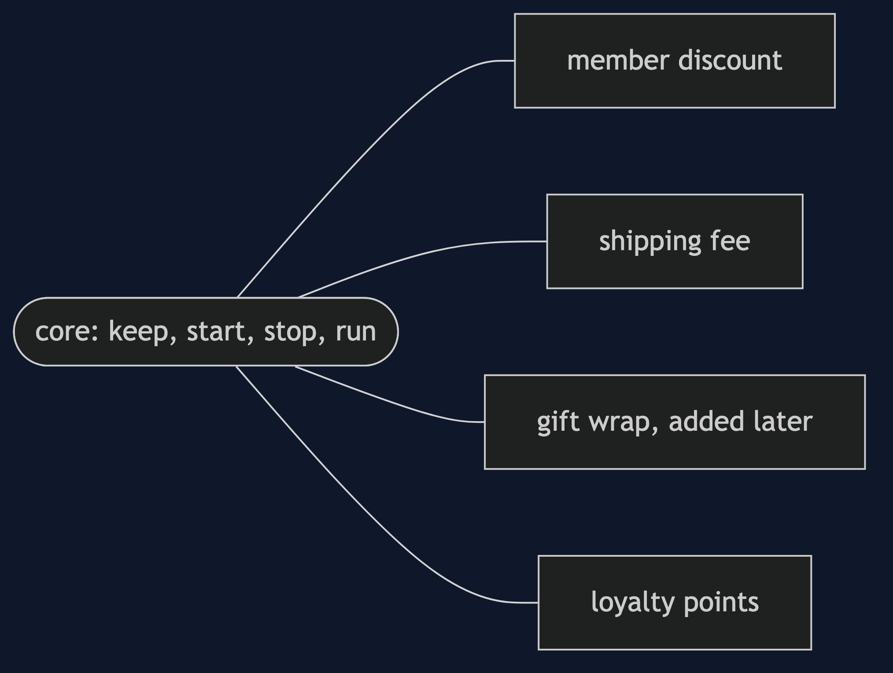
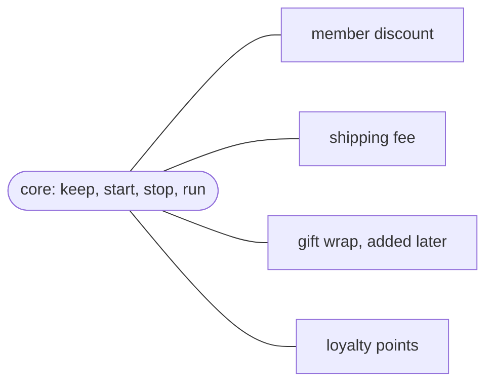

# Microkernel Pattern — Architecture Diagram

A small core in the middle. Every feature plugs into it.

Mermaid source

```mermaid
flowchart LR
    C(["core: keep, start, stop, run"])
    C --- A["member discount"]
    C --- B["shipping fee"]
    C --- G["gift wrap, added later"]
    C --- L["loyalty points"]
```

