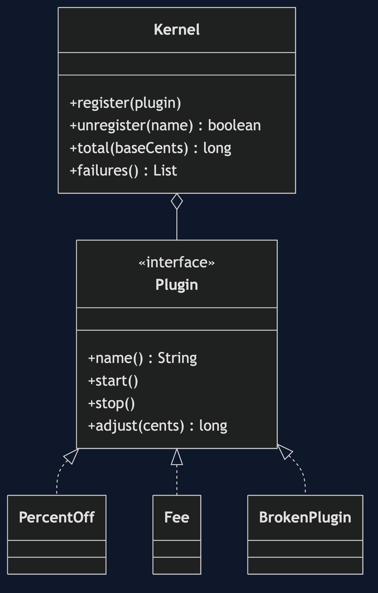
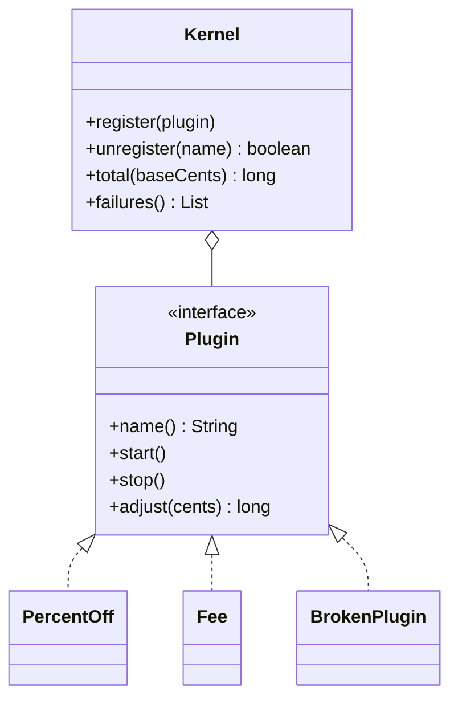

# Microkernel Pattern — Class Diagram

A kernel that knows only the Plugin interface.

Mermaid source

```mermaid
classDiagram
    class Kernel {
        +register(plugin)
        +unregister(name) boolean
        +total(baseCents) long
        +failures() List
    }
    class Plugin {
        <<interface>>
        +name() String
        +start()
        +stop()
        +adjust(cents) long
    }
    Kernel o-- Plugin
    Plugin <|.. PercentOff
    Plugin <|.. Fee
    Plugin <|.. BrokenPlugin
```

