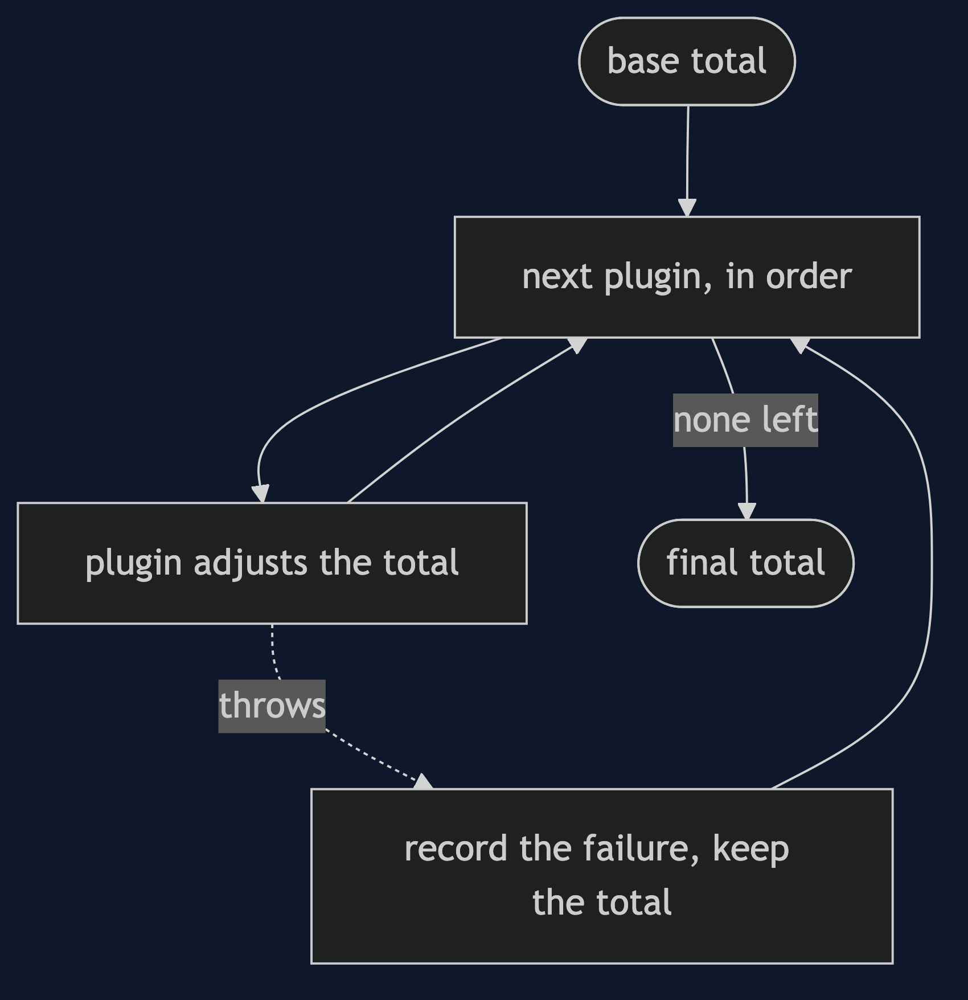
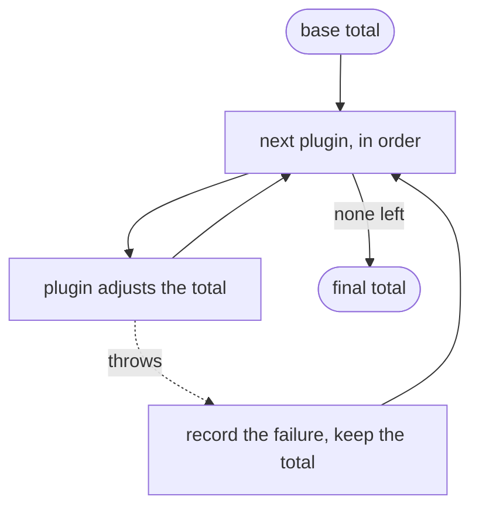

# Microkernel Pattern — Data Flow Diagram

What the core does to price an order.

Mermaid source

```mermaid
flowchart TD
    Start(["base total"])
    Next["next plugin, in order"]
    Run["plugin adjusts the total"]
    Fail["record the failure, keep the total"]
    Done(["final total"])
    Start --> Next --> Run --> Next
    Run -. throws .-> Fail --> Next
    Next -- none left --> Done
```

