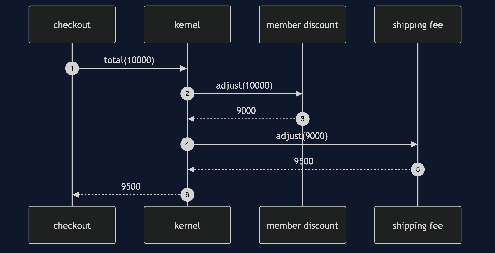
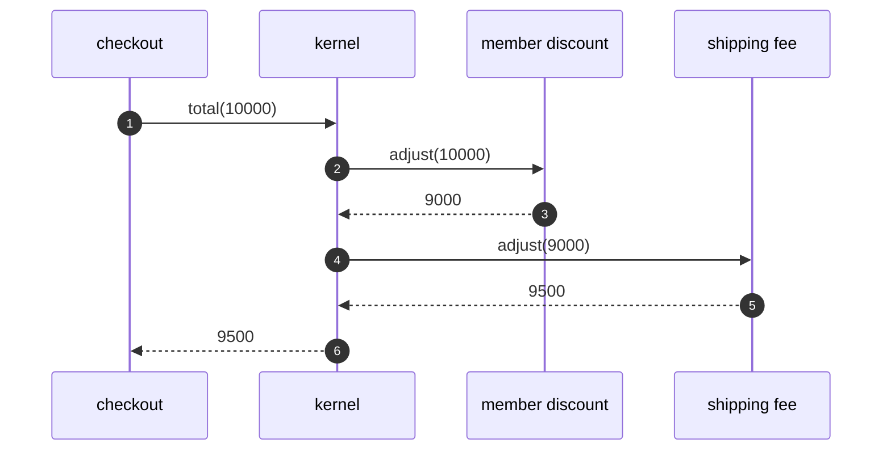

# Microkernel Pattern — Sequence Diagram

Written for a listener with the screen off.

Say it in words. The checkout asks the kernel for the total of ten thousand. The kernel asks the member discount plugin, which takes off ten percent. It asks the shipping fee plugin, which adds five hundred. The kernel returns ninety five hundred. The kernel never knew what either plugin did.

Mermaid source

The load-bearing sentence: **the kernel passes the total along, and does not know what each plugin does.**
