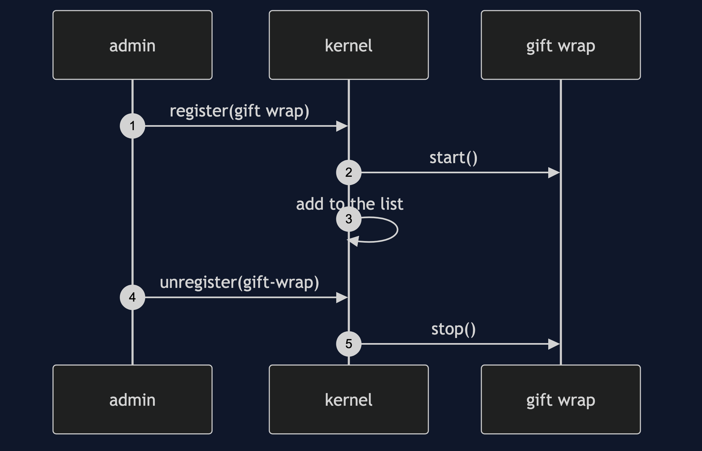
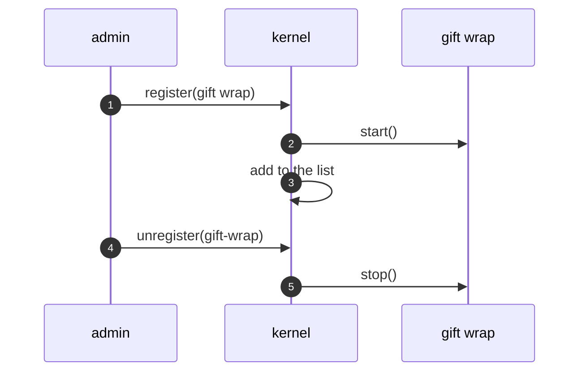

# Microkernel Pattern — UML Sequence Diagrams

Four sequences.

## 1. Adding A Plugin

Mermaid source

```mermaid
sequenceDiagram
    autonumber
    participant A as admin
    participant K as kernel
    participant G as gift wrap
    A->>K: register(gift wrap)
    K->>G: start()
    K->>K: add to the list
    A->>K: unregister(gift-wrap)
    K->>G: stop()
```

