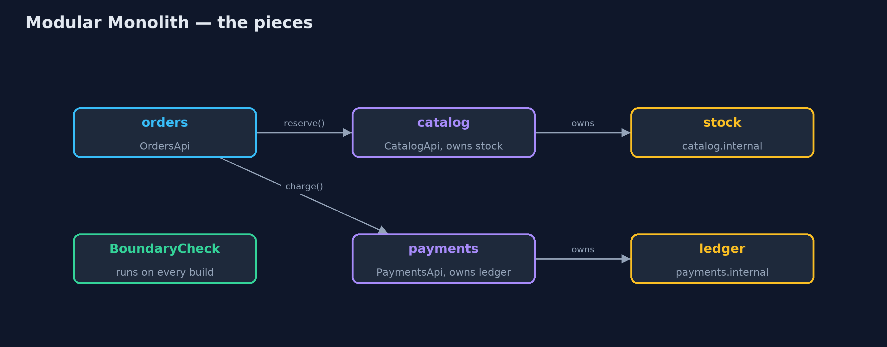
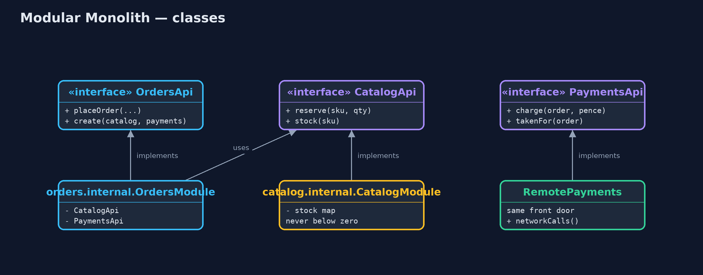
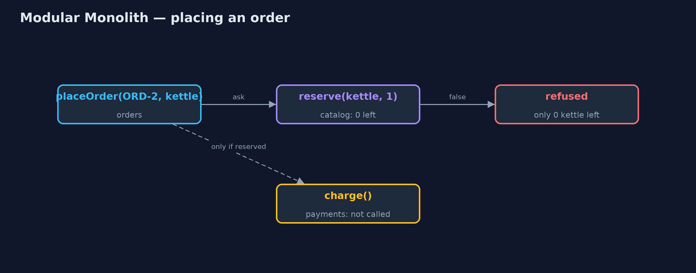
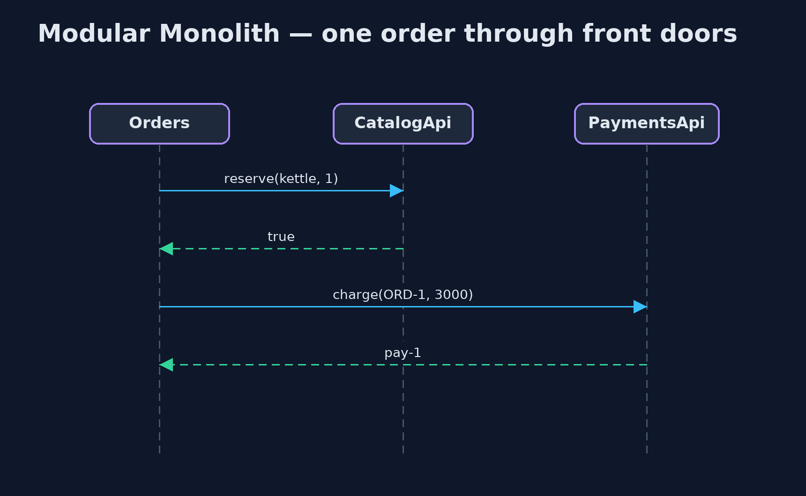

# Modular Monolith Pattern

```
src/main/java/com/jk/explore/modularmonolith/
├── BoundaryCheck.java                     Checks the rule Java cannot: code in one module may not use another module's internal package
├── ModularMonolithDemo.java               The five acts: the ball of mud, modules with front doors, the boundary check, moving a module out, and the bill
├── catalog/CatalogApi.java                The catalogue module's front door: the only way other modules may touch stock
├── catalog/internal/CatalogModule.java    Inside the catalogue: owns the stock table and its rule that stock never goes below zero
├── mud/MudCheckout.java                   Checkout in the big ball of mud: writes straight into the stock and payment tables
├── mud/Tables.java                        Without the pattern: every table is public, so any part of the shop can read and change any of them
├── orders/OrdersApi.java                  The orders module's front door
├── orders/internal/OrdersModule.java      Inside orders: reserves stock through the catalogue's front door, then charges through payments'
├── payments/PaymentsApi.java              The payments module's front door: take a payment, or ask what was taken
├── payments/RemotePayments.java           Payments after it has been moved into its own service: the same front door, now over the network
└── payments/internal/PaymentsModule.java  Inside payments: its own ledger, which no other module can see
```

**Build one program, but split it into modules that own their data and talk only through front doors, and check those walls on every build.**

A monolith is a program that is built and deployed as one piece. A modular
monolith is still one piece, but inside it is divided into modules, such as
catalogue, orders and payments. Each module owns its own data and its own
rules, and offers a small public front door, an API. Other modules may only
use that front door, never the module's insides.

It gives you most of the tidiness of microservices without the network, the
separate deployments and the distributed failures. And because every module is
already behind a front door, one of them can later be moved into its own
service without rewriting the others.

## The idea in everyday terms

Think of a department store. It is one building, with one front entrance and
one set of opening hours. But the shoe department has its own staff and its own
stockroom, and the kitchenware department does not wander into it to take
boxes off the shelves. They ask at the counter.

If the shoe department ever grows big enough to need its own shop across the
road, it can move, and the kitchenware staff still just ask at a counter.

## The scenario

The online store is one Java program. Checkout, the catalogue and payments all
lived in the same code with every table open to every class. Checkout changed
the stock table directly, skipping the catalogue's rule that stock never goes
below zero, and the shop sold one kettle to two customers.

## Run

```bash
./gradlew run
```

The demo tells the story in 5 acts, each printing exact numbers that the tests check:

| Act | What it shows |
| --- | --- |
| 1. Every table open | Checkout writes the stock table itself; one kettle in stock is sold twice and stock becomes -1. |
| 2. Modules with front doors | Orders reserves through CatalogApi: ORD-1 placed, ORD-2 refused with only 0 left; stock stays at 0. |
| 3. Boundaries checked | Scanning the source finds 0 modules reaching inside another; an added import of payments.internal into orders is caught. |
| 4. Moving a module out | RemotePayments replaces the in-process module: ORD-3 placed with 1 network call, and 0 lines changed in orders. |
| 5. The bill | 3 modules, 1 build, 1 deployment; one process that crashes and scales as a whole; walls that last only while checked. |

## Test

```bash
./gradlew test
```

9 tests in `DemoRunsTest`, `ModulesTest`. Every number the demo prints is asserted, and nothing depends on the clock, so every run gives the same result.

## Technologies and versions

| Technology | Version | Used for |
| --- | --- | --- |
| Java | 21 | the code (toolchain set in `build.gradle`) |
| Gradle | 9.2.1 (wrapper) | build and run, nothing to install |
| JUnit | 5.10.2 | the tests |
| videokit | repository tool | the narrated video and animation: Piper `en_US-amy-medium`, speed 0.8, longer pauses (the approved `amy-slow` voice) |

## Learning Material

| Document | What it is for |
| --- | --- |
| [Problem statement](docs/problem-statement.md) | the situation and what the project must show |
| [Prerequisites](docs/prerequisites.md) | what you need to know first |
| [Modular Monolith, explained](docs/modular-monolith-pattern-explained.md) | the acts in prose |
| [Session guide](docs/session.md) | a one-hour lesson with exercises |
| [Animated walkthrough](docs/animation.html) | the acts step by step, narrated |
| [Spec](docs/spec.md) | what this project must be true of |

### The pattern in one picture

One program; three modules; every arrow goes through a front door.



### Where each piece sits

Public interfaces in each module's top package; implementations in internal.



### How the data moves

Stock is reserved before any money is taken; a refusal stops the order.



### Who calls whom, in order

Orders never sees stock or the ledger, only the answers.



### Video

`video/modular-monolith-pattern-explained.mp4` (with `.m4a` audio and `.srt` subtitles) is built by `video/build_video.sh`. Rendered media is not committed.

## What it costs

- **Still one deployment.** A fix to payments redeploys the catalogue and orders too.
- **Still one process.** A crash or a memory leak in one module stops all of them, and they scale together.
- **Walls need checking.** Java lets any public class be used from anywhere; without a check on every build, the walls quietly disappear.
- **Front doors take design.** Deciding what each module offers, and what it keeps inside, is real work.

## When this is too much

A small program with one team and one kind of data does not need modules
beyond ordinary packages. And when parts genuinely need separate deployment,
separate scaling or separate teams releasing on their own schedule, that is the
point at which a module becomes a microservice.

## Where you have already met this

- Java's own module system (`module-info.java`), with `exports` naming the public packages.
- ArchUnit tests that fail the build when one package uses another it should not.
- Spring Modulith, which checks module boundaries in Spring Boot applications.
- Shopify's and GitHub's large monoliths, split into internal components.

## Where this sits

This project is in [architectural-design-patterns](..), next to
[Layered Architecture](../layered-architecture-pattern), which slices a program
into layers across it, and [Hexagonal Architecture](../hexagonal-architecture-pattern),
which puts front doors (ports) around a single core. A modular monolith slices
by business area instead.
