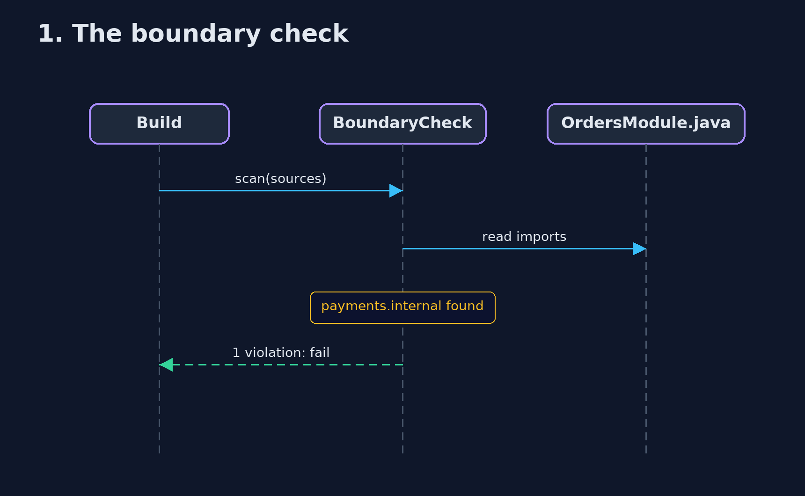
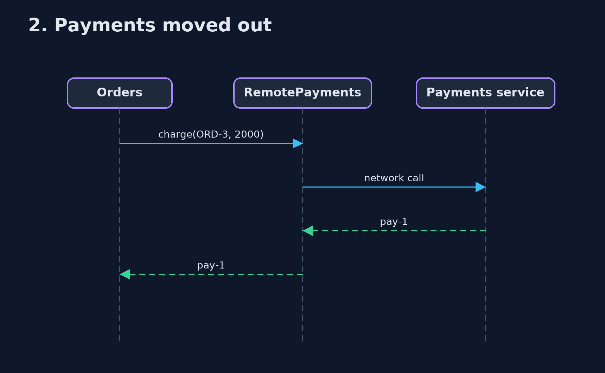

# Modular Monolith Pattern — UML Sequence Diagrams

## 1. 1. The boundary check

An import of another module's insides fails the build.

## 2. 2. Payments moved out

The same front door, answered over the network.

