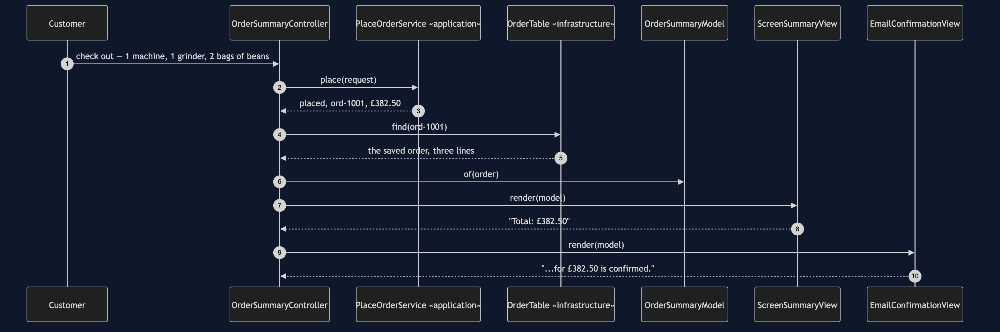
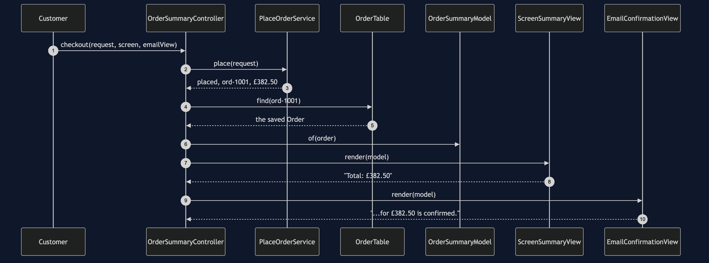
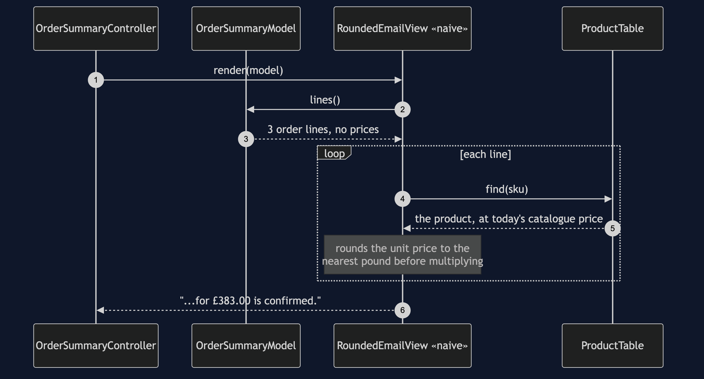
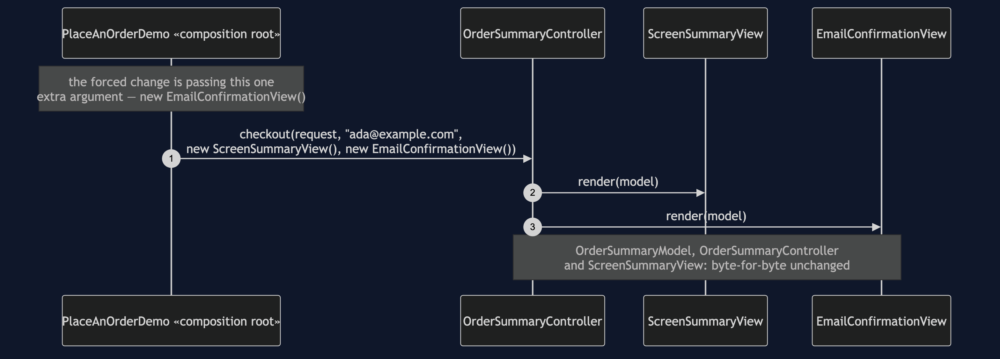
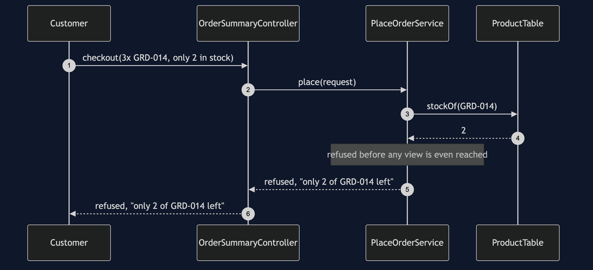

# MVC Pattern

```
src/main/java/com/jk/explore/mvc/
├── PlaceAnOrderDemo.java          composition root — the five acts
├── ForcedChange.java              counts the bill, from real files on disk
│
├── model/                         ← the one place a total is computed
│   └── OrderSummaryModel.java
├── view/                          ← may depend only on model
│   ├── OrderSummaryView.java       «interface» — one method, one parameter
│   ├── ScreenSummaryView.java
│   ├── EmailConfirmationView.java  the forced change
│   └── CompositeOrderView.java
├── controller/                    ← the only class that calls application
│   └── OrderSummaryController.java
├── application/
│   ├── PlaceOrderService.java
│   ├── PlaceOrderRequest.java
│   └── PlaceOrderResult.java
├── domain/
│   ├── Order.java
│   ├── OrderLine.java
│   ├── OrderStatus.java
│   ├── Product.java
│   ├── Money.java
│   └── CheckoutRefusedException.java
├── infrastructure/
│   ├── OrderTable.java · InMemoryOrderTable.java
│   ├── ProductTable.java
│   ├── CardNetwork.java · EmailServer.java · PaymentDeclinedException.java
│
└── naive/                         ← kept on purpose, outside the real architecture
    ├── EverythingOrderScreen.java         no separation at all
    └── view/
        └── RoundedEmailView.java          the shortcut — skips the model
```

Twenty-one classes make the real architecture; two more show what it
replaces. `src/test/java/.../mvc/ArchitectureTest.java` is what checks the
one rule that matters: no class in `view` may depend on `infrastructure`.

**Split a screen into three roles — a Model that owns state and
computation, a View that only renders, and a Controller that turns input
into calls on the model — so that two views of the same fact are
structurally incapable of disagreeing.**

This is project 64 of [architectural-design-patterns](..), one step from
[Layered Architecture](../layered-architecture-pattern): the same shared
feature, the same four-step checkout underneath, with one new question laid
on top — once an order is placed, who is allowed to compute what a customer
is shown.

## Run

```bash
./gradlew run
```

Five acts.

```
THREE. A second view, the shortcut way.
Order ord-1001 placed.
  1 x ESP-001  £249.00
  1 x GRD-014  £89.50
  2 x BNS-220  £44.00
  Total: £382.50
  Thank you. Your order ord-1001 for £383.00 is confirmed.
  the screen says £382.50. the email says £383.00.
  NOTHING IN THE BUILD OBJECTED.
```

```
FIVE. Add the real second view.
  ...
  Thank you. Your order ord-1001 for £382.50 is confirmed.
  both views: £382.50. every time, because neither
  one is allowed to add up a price.

  FORCED CHANGE: add a second view over the same model
    one screen  ->  one screen and one email, both reading
    the same OrderSummaryModel

    files added     : 1   view/EmailConfirmationView.java
    files modified  : 1   PlaceAnOrderDemo.java (the composition root)
    lines changed   : 2
    classes across model + controller + views : 21
    of those, opened                          : 1
    of those, never opened                    : 20

  AND THE ONE THAT TOOK THE SHORTCUT
    naive/view/RoundedEmailView.java imports ProductTable directly
    it rounds each unit price itself instead of asking the model
    every real view, screen and email alike: agrees, exactly
```

And the acceptance line every project in this category prints identically:

```
ACCEPTANCE
  order ord-1001 for cust-8801: PLACED, 3 lines, £382.50
  stock ESP-001 3, GRD-014 1, BNS-220 38
  charged cust-8801 £382.50 once
  sent 1 confirmation to ada@example.com
  refused: not enough stock, unknown product, payment declined
```

## Test

```bash
./gradlew test
```

Nineteen tests. Three assert the dependency rule on the real packages; one
widens it to `naive.view` and asserts the failure names `RoundedEmailView`
and `ProductTable`. `ViewsAgreementTest` is the one worth reading first:
`twoRealViewsAlwaysAgree` proves the guarantee, and
`theNaiveShortcutReallyDoesDisagree` proves the bug is real arithmetic
rather than a claim in prose — the burr grinder's £89.50 genuinely rounds to
£90 and the total genuinely comes out £383.00.

## Technologies and versions

| What | Version | Why it is here |
| --- | --- | --- |
| Java | 21 | The repository standard |
| Gradle | 9.2.1 | The wrapper in this directory |
| JUnit 5 | 5.10.2 | Test runner |
| ArchUnit | 1.5.0 | Test-only. The view/infrastructure rule is written and enforced with it, exactly as in [Layered Architecture](../layered-architecture-pattern) |

No Spring, no UI toolkit, no database. Every view in this project produces a
`String`.

## Learning Material

| Document | What it covers |
| --- | --- |
| [`docs/problem-statement.md`](docs/problem-statement.md) | Two views, one order, two totals |
| [`docs/mvc-pattern-explained.md`](docs/mvc-pattern-explained.md) | The pattern, classic vs web MVC, MVP/MVVM, the forced change, the bill |
| [`docs/class-diagram.md`](docs/class-diagram.md) | The types, and the one class with a second dependency |
| [`docs/architecture-diagram.md`](docs/architecture-diagram.md) | What is allowed to know about what |
| [`docs/data-flow-diagram.md`](docs/data-flow-diagram.md) | One order, built into one model, read by every view |
| [`docs/sequence-diagram.md`](docs/sequence-diagram.md) | Who calls whom — written for a listener with the screen off |
| [`docs/uml-diagram.md`](docs/uml-diagram.md) | Four sequences: the pattern, the shortcut, the forced change, a refusal |
| [`docs/animation.html`](docs/animation.html) | Five steps in a browser |
| [`docs/prerequisites.md`](docs/prerequisites.md) | What you need to know, and what you explicitly do not |
| [`docs/session.md`](docs/session.md) | A one-hour taught session with three exercises |
| [`docs/spec.md`](docs/spec.md) | The generated specification |
| [`docs/youtube.md`](docs/youtube.md) | Title, description and chapters |

### The pattern in one picture

Four classes implement `OrderSummaryView`; only one of them has a second
dependency, straight to `ProductTable`, and that single extra arrow is the
whole bug.


### What is allowed to know about what

Every real view has exactly one arrow, and it points at the model. The
dashed box is the shortcut the architecture test exists to catch.


### How one order becomes two agreeing outputs

The model is built exactly once; the dashed path is the only way to reach a
different number.


### Who calls whom, in order

The sequence written to work with the screen off: a model built once, handed
to two views, neither of which can compute anything.



### All four sequences

The full set from [`docs/uml-diagram.md`](docs/uml-diagram.md).

**One. One order, rendered by two views that cannot disagree.**



**Two. The shortcut — a view that rounds its own prices.**



**Three. The forced change — a real second view, nothing else touched.**



**Four. A refusal — not enough stock.**



### Video

Built from [`video/scenes.py`](video/scenes.py) by
[`video/build_video.sh`](video/build_video.sh). The rendered file is not
committed.

## When this is too much

A Model/View/Controller split earns its keep the moment more than one
output has to represent the same state. It is not worth it for a program
with exactly one output that will never grow a second — a single method
that computes and prints in one pass is not a shortcut in that case, it is
the whole of what is needed.

## Where this sits

Project 64 of [`architectural-design-patterns`](..), one step from
[Layered Architecture](../layered-architecture-pattern) — the same shared
feature and application layer, with the presentation side split into a
model and views this time instead of a single screen class.

The next project, **Hexagonal Architecture**, changes the thing this
category's first project admitted it had not fixed: the application layer
still names the infrastructure package to compile. This project does not
touch that; its whole subject is what happens once an order has already
been placed.

## Also available with a framework

[MVC with Spring MVC Pattern](../mvc-with-spring-mvc-pattern) reruns this idea on a real framework, and shows what the framework adds and where it can undo the pattern. Watch this project first.
