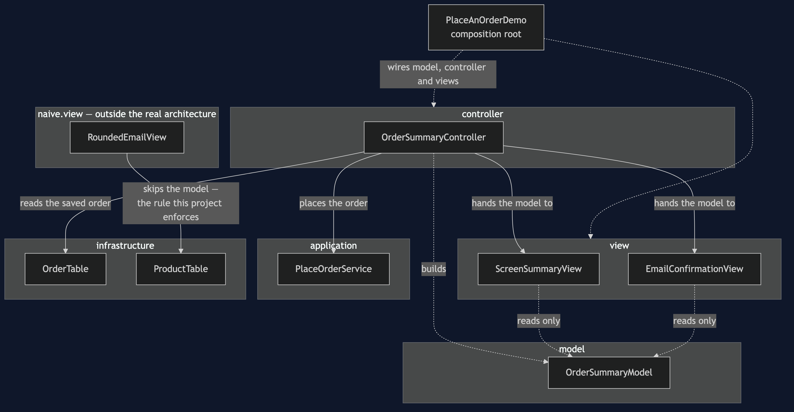
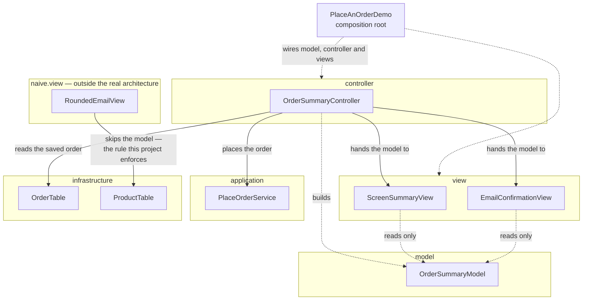

# MVC Pattern — Architecture Diagram

Where each class sits, and which arrows are allowed. The class diagram shows
the types and the sequence diagrams show the order of events; this one
answers **what is allowed to know about what**.

Read it as three boxes across the top — Model, View, Controller — sitting
above the application and infrastructure layers this category's first
project already established. The controller is the only box with a line
down to application; every real view has a line only to the model.

Mermaid source

## Reading The Diagram

**Every real view has exactly one arrow, and it points at the model.**
`ScreenSummaryView` and `EmailConfirmationView` have no line to
`application` or `infrastructure` anywhere on this diagram, because they
have no import of either.

**The controller is the single seam between the two halves.** It is the
only box with a line to `PlaceOrderService`, and the only box with a line
to a view. A view never calls the application layer, and the application
layer never constructs a view.

**The dashed box is not part of the architecture.** `RoundedEmailView`'s one
arrow — straight to `ProductTable`, skipping the model entirely — is the
line `ArchitectureRuleCatchesTheShortcutTest` widens the dependency rule to
catch.
