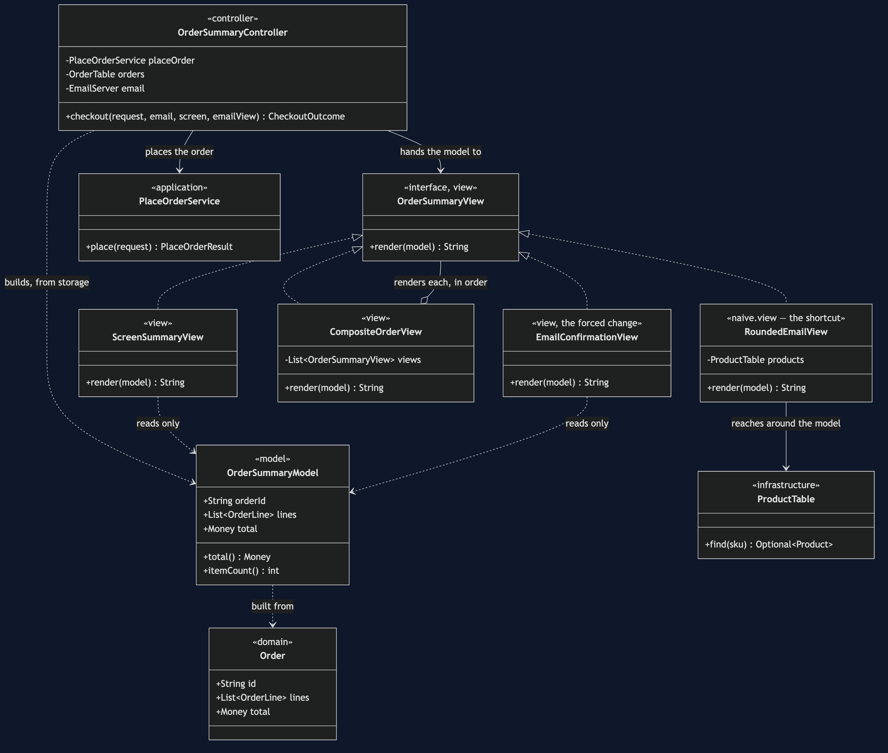
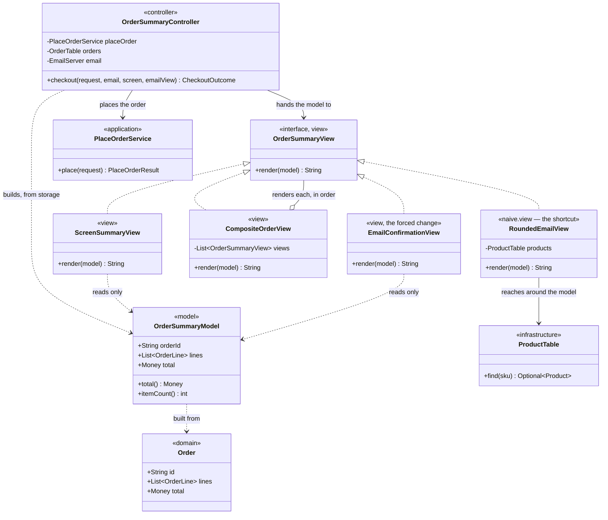

# MVC Pattern — Class Diagram

Shows the static structure: the narrow view interface, the model both real
views read, the naive view that reaches around it, and the composite that
lets several views be treated as one.

The single most important thing on this diagram is `OrderSummaryView`'s one
method, and its one parameter type. `RoundedEmailView` is drawn with a
second arrow — to `ProductTable` — that neither `ScreenSummaryView` nor
`EmailConfirmationView` has anywhere on this diagram.

Mermaid source

## Reading The Diagram

**Four classes implement `OrderSummaryView`, and only one of them has a
second dependency.** `ScreenSummaryView`, `EmailConfirmationView` and
`CompositeOrderView` touch nothing but the model (and, for the composite,
other views). `RoundedEmailView` alone reaches down into `ProductTable`,
and that single extra arrow is the entire mechanism of the bug this project
demonstrates.

**`OrderSummaryController` is the only class that depends on
`PlaceOrderService`.** No view anywhere on this diagram has a line to the
application layer — a view is handed a finished model and nothing else, so
there is no path by which a view could place an order, only render one that
has already been placed.

**`OrderSummaryModel` has no outgoing arrow to any view.** It is built once,
from a stored `Order`, and handed downward to whichever views the caller
wants rendered; it never reaches up to ask a view to redraw, which is the
simplification this project makes to classic MVC's observation for a
synchronous console demo.
