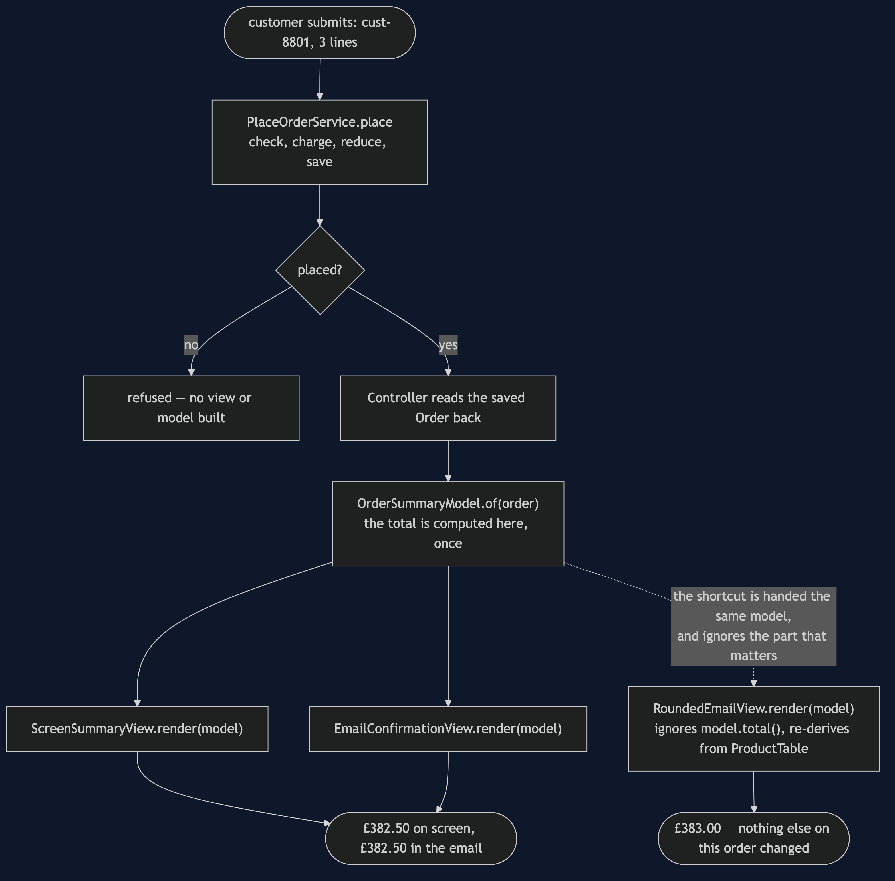
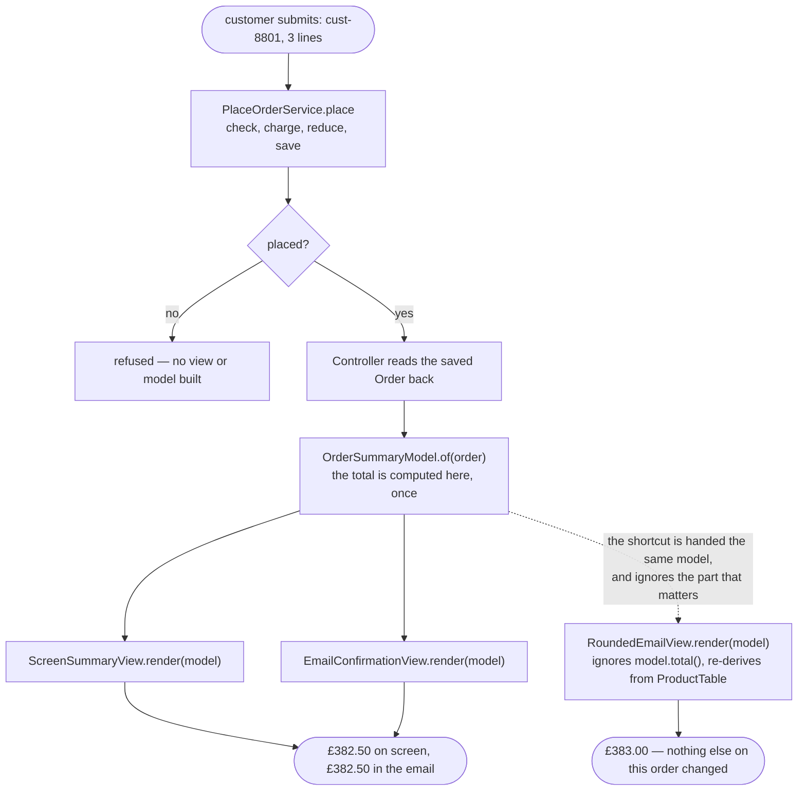

# MVC Pattern — Data Flow Diagram

One order, followed from checkout to two rendered outputs, with the moment
the naive path diverges drawn as its own branch.

The detail worth watching: the model is built exactly **once**, from the
saved order, and every view downstream of that point receives the identical
object. The only way to reach a different number is to step off this graph
entirely — which is exactly what the dashed path does.

Mermaid source

## Reading The Diagram

**`Build` has exactly one incoming edge and several outgoing ones.** The
total is computed once, at that single node, and every view downstream only
ever reads it back.

**The dashed edge from `Build` to `Shortcut` is the whole bug.**
`RoundedEmailView` is handed the same `OrderSummaryModel` every other view
gets — the diagram shows that plainly — and the box after it is where the
bug actually happens: it is handed the right answer and computes a
different one anyway, by going around it to `ProductTable`.

**`Refuse` has no path to `Build` at all.** A refused order never reaches a
model or a view, matching the shared feature's rule that a refusal changes
nothing.
