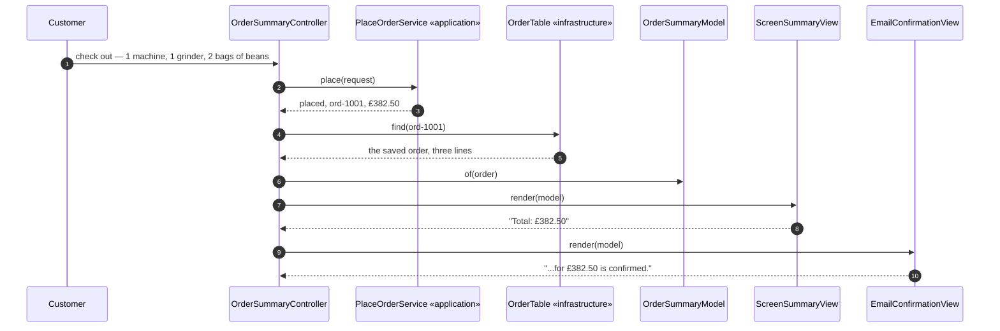

# MVC Pattern — Sequence Diagram

One order, rendered twice, in the order the calls actually happen — written
so a listener with the screen off can follow who calls whom.

Say it in words. A customer checks out through the controller. The
controller places the order through the application layer, exactly as the
first project in this category does, and then reads the saved order back
out of storage. From that saved order it builds one model — a small object
holding the order's lines and its one total. Then, and only then, does it
hand that model to a screen view and an email view, one after the other.
Neither view is told how the total was worked out. Neither view is capable
of asking.

Mermaid source

Say the load-bearing sentence aloud, because it is the one a picture cannot
carry on its own: **the model is built once, from what was actually saved,
and handed downward to every view — no view is ever handed anything it
could compute a different number from.**

For the shortcut that skips the model, the forced change that adds a second
real view, and a refusal that never reaches a view at all, see
[`uml-diagram.md`](uml-diagram.md) — the rejected designs and the failure
modes live there.
