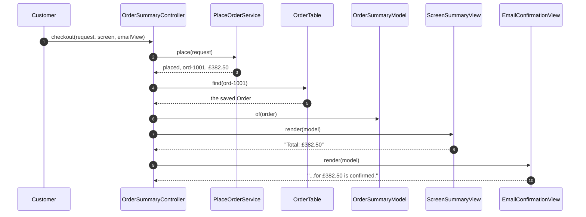
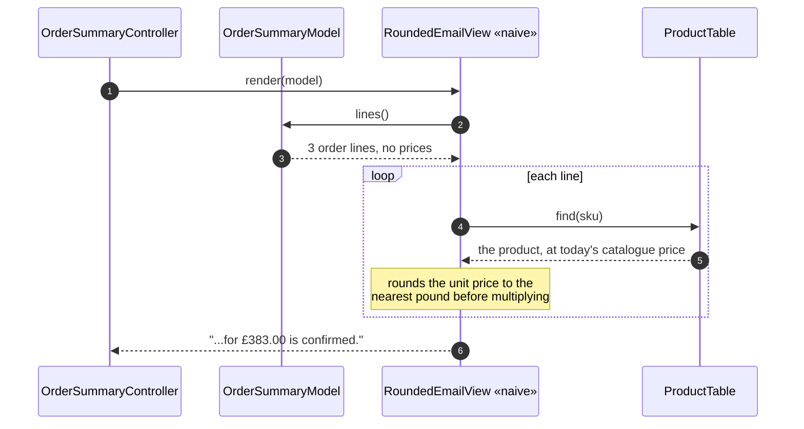
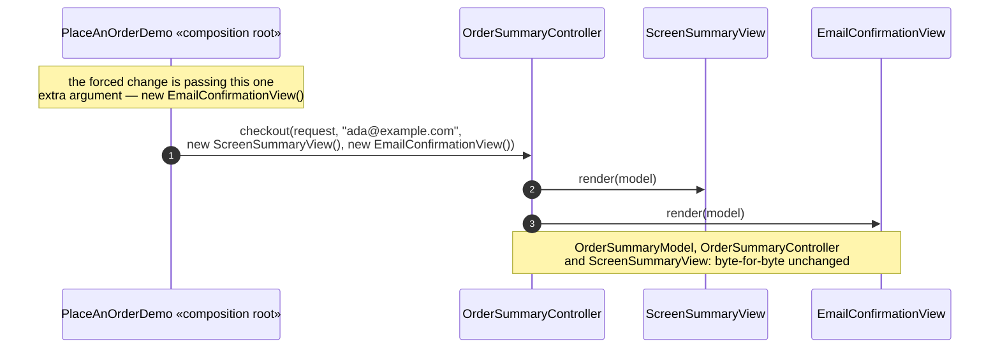
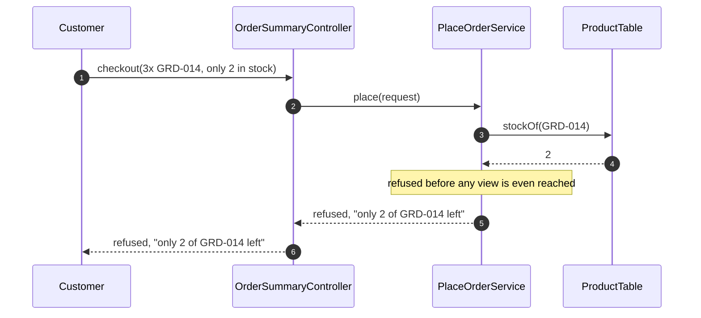

# MVC Pattern — UML Sequence Diagrams

Four sequences: the pattern working, the shortcut that breaks it, the forced
change, and a refusal.

## 1. One Order, Rendered By Two Views That Cannot Disagree

The model is built once; both views read it and neither computes anything.

Mermaid source

Steps 7 and 9 call the same method on two different classes with the same
argument. Neither `render` implementation contains a `+` or a `*` — the
agreement is not tested for, it is structural.

## 2. The Shortcut — A View That Rounds Its Own Prices

Mermaid source

Compare this with sequence 1. `RoundedEmailView` never asks the model for
`total()` at all — it asks for the raw lines and goes hunting for prices
itself, in a class the model has no relationship with.

## 3. The Forced Change — A Real Second View, Nothing Else Touched

Mermaid source

## 4. A Refusal — Not Enough Stock

Mermaid source

No view or model is constructed at all on this path — a refusal never
reaches the presentation side of the controller.
