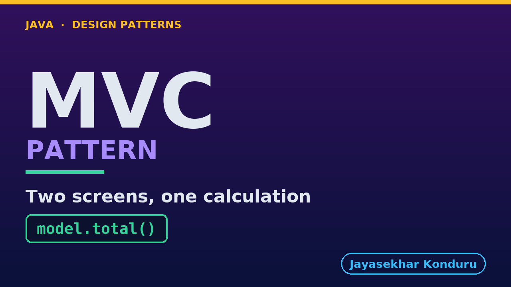

# YouTube — Mvc Pattern

Everything needed to publish `video/mvc-pattern-explained.mp4`. Copy the fields straight out of this file.

Chapter timings are generated from the video's `.srt`. Re-run `python3 docs/make_youtube_docs.py mvc` after any change to the narration, or they will be wrong.

## Title

```
MVC in Java - The View That Knew Too Much
```

41 characters — under the 60 YouTube shows before truncating in search results.

## Description

The first two lines are what a viewer sees above the fold, so they carry the hook rather than the boilerplate.

```
Learn the Model View Controller pattern, MVC, in Java with an online store where a screen and a confirmation email must show the same order total. The model holds the data and does the one calculation that matters, the views only display it, and the controller takes the input and picks a view, like one reporter's facts printed in the paper and on the website. We watch one view work out the total for itself and explain why that is a structural bug, not a typo. We compare classic MVC with the web MVC you have probably used, touch on MVP and MVVM, write the rule as a test and count the bill. Two views cannot disagree about a number neither of them is allowed to calculate.

CHAPTERS
00:00 Introduction
01:03 The Scenario
01:38 Version One — No Separation At All
02:11 Three Roles
02:54 The Shortcut
03:49 The Whole Mechanism, In One Interface
04:24 Classic MVC, And The MVC You Have Used
05:10 MVP And MVVM, In One Scene
06:00 The Rule, Written Where A Build Can Read It
06:33 Watching It Go Red
06:55 The Forced Change
07:38 Both Views, Every Time
08:06 The Bill
08:48 When This Is Too Much
09:13 Thanks for Watching

SOURCE CODE, WRITTEN NOTES AND AN INTERACTIVE ANIMATION
https://github.com/jk-boot-up/java-design-patterns/tree/main/gradle-java/architectural-design-patterns/mvc-pattern

WHAT YOU NEED FIRST
Java 21 and a working knowledge of classes and interfaces. No prior design-pattern knowledge is assumed. The full prerequisites are in docs/prerequisites.md in the repository.
```

## Chapters

YouTube renders these as chapters only if there are at least three and the first is at `00:00`.

```
00:00 Introduction
01:03 The Scenario
01:38 Version One — No Separation At All
02:11 Three Roles
02:54 The Shortcut
03:49 The Whole Mechanism, In One Interface
04:24 Classic MVC, And The MVC You Have Used
05:10 MVP And MVVM, In One Scene
06:00 The Rule, Written Where A Build Can Read It
06:33 Watching It Go Red
06:55 The Forced Change
07:38 Both Views, Every Time
08:06 The Bill
08:48 When This Is Too Much
09:13 Thanks for Watching
```

## Tags

```
mvc pattern, model view controller, mvp and mvvm, design patterns, java design patterns, gang of four, java 21, software design, clean code, object oriented design, java tutorial, ecommerce, programming tutorial
```

211 characters, under YouTube's 500 limit.

## Thumbnail



**Upload `docs/thumbnail.png`** — 1280×720, the size YouTube recommends, generated by `docs/make_thumbnails.py`. It is deliberately not the same image as the video's opening frame: a thumbnail is judged at about 360 pixels wide in a search result, so this one carries only the pattern name, one line of promise and one short piece of code, each set large enough to survive the shrink.

`video/poster.png` is the 1920×1080 opening frame, produced by the video build. It stays in the repository as the title card; it is not what gets uploaded.

YouTube will not pick the thumbnail up on its own — upload it under **Details → Thumbnail → Upload file**. A custom thumbnail requires a verified channel.

## Upload checklist

- [ ] Upload `video/mvc-pattern-explained.mp4` (1080p, H.264, 30 fps, AAC 48 kHz — already YouTube's recommended settings, no re-encode needed)
- [ ] Set the video language to **English** first, or the subtitle option may not appear
- [ ] Add subtitles: *Video elements → Add subtitles → Upload file → With timing* → `video/mvc-pattern-explained.srt`
- [ ] Upload `docs/thumbnail.png` as the thumbnail — do not let YouTube auto-pick a frame
- [ ] Paste the title, description and tags from above
- [ ] Add to the **Java Design Patterns** playlist, in learning order
- [ ] Wait for 1080p processing before sharing the link — code slides are unreadable at 360p

## Cards and end screen

End screen links to whichever pattern video goes up next — set it at upload time rather than assuming an order.

Add a card partway through pointing at the playlist, so a viewer who arrives at this pattern from search can find the rest of the series.

## Runtime

Approximately 10:02, narrated at 145 words per minute.
