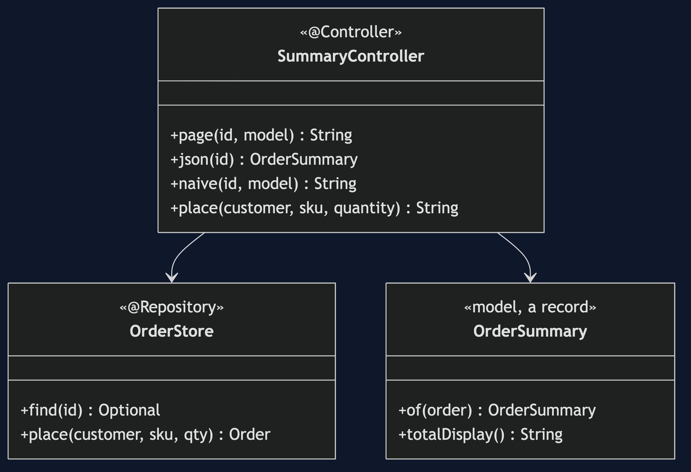
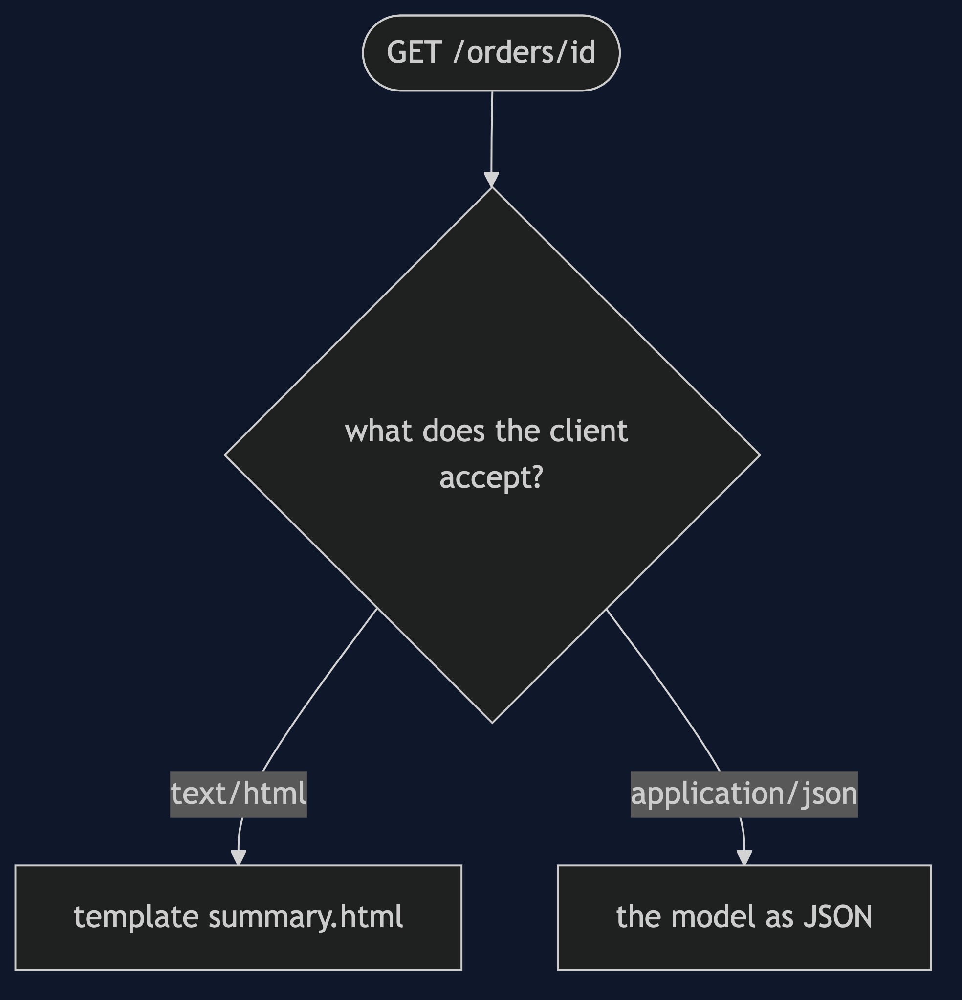
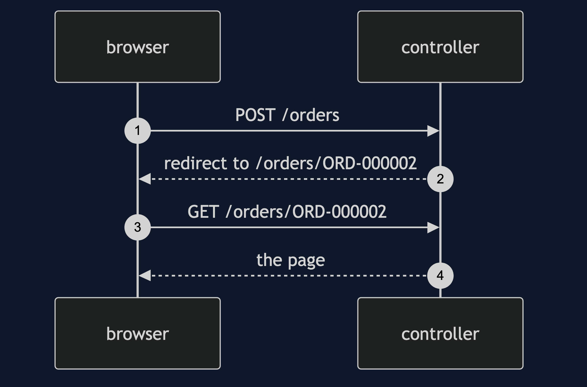

# MVC with Spring MVC Pattern

```
src/main/java/com/jk/explore/mvcspring/
├── SummaryApplication.java   the entry point and the six acts
├── SummaryController.java    the controller
├── OrderSummary.java         the model: the one place the total is worked out
├── OrderStore.java  Order.java  Line.java
src/main/resources/templates/
├── summary.html              the view: shows, and computes nothing
└── naive-summary.html        the shortcut: does its own sums
```

**In Spring MVC the controller names a view and a model, and the framework renders. The pattern holds as long as the template only shows.**

This project is the framework version of [MVC](../mvc-pattern). That project built the mechanism by hand. This one shows the same idea inside Spring MVC. It does not re-teach the pattern. It shows what Spring MVC adds, the failures that are its own, and what it costs.

## Run

```bash
./gradlew run
```

Six acts. The partner project, MVC, built the mechanism by hand. Here the same idea runs through Spring MVC, and every count comes from real output.

```
ONE. The controller names a view.
  GET /orders/ORD-000001, as a browser -> 200, text/html.
  the page says: Total: £292.50, Discount: £32.50.
TWO. The same model, a second view.
  GET /orders/ORD-000001, as a program -> 200 {"orderId":"ORD-000001","customer":"ada","lines":[{"sku":"ESP-001","quantity":1,"pricePence":30000},{"sku":"BNS-220","quantity":2,"pricePence":1250}],"subtotalPence":32500,"discountPence":3250,"totalPence":29250}
  the controller method changed, and the model did not.
THREE. The total is worked out once per request.
  summaries computed for one page view: 1.
  the model alone, no server: £292.50.
FOUR. A sum in the view.
  the shortcut view says: Total: 32500. the model says 29250 pence.
  the view added up the lines and never heard of the discount.
FIVE. The same view, another order.
  POST /orders -> 302 redirect to /orders/ORD-000002.
  the shortcut view on that one-line order: 500.
  the real view on it: 200, Total: £12.50.
SIX. Post, redirect, get.
  the form post answered with a redirect, not a page.
  refreshing the browser repeats the GET, and cannot place the order twice.
```

## Test

```bash
./gradlew test
```

2 test classes, 7 test methods, offline, with each Spring context started inside the test, and no server.

## Technologies and versions

| What | Version | Why it is here |
| --- | --- | --- |
| Java | 21 | The repository standard, via the Gradle toolchain block |
| Gradle | 9.2.1 | The wrapper in this directory; no separate install needed |
| Spring Boot | 4.1.1 | The container and the web server |
| Thymeleaf | managed | The template engine |
| JUnit 5 | 5.10.2 | Test runner |

See [`docs/dependencies.md`](docs/dependencies.md).

## Learning Material

| Document | What it covers |
| --- | --- |
| [`docs/problem-statement.md`](docs/problem-statement.md) | The partner's summary, and what is new |
| [`docs/mvc-with-spring-mvc-pattern-explained.md`](docs/mvc-with-spring-mvc-pattern-explained.md) | Views chosen by the framework |
| [`docs/class-diagram.md`](docs/class-diagram.md) | The types |
| [`docs/architecture-diagram.md`](docs/architecture-diagram.md) | Controller, model and two views |
| [`docs/data-flow-diagram.md`](docs/data-flow-diagram.md) | A request through the controller |
| [`docs/sequence-diagram.md`](docs/sequence-diagram.md) | Written for a listener with the screen off |
| [`docs/uml-diagram.md`](docs/uml-diagram.md) | Four sequences |
| [`docs/animation.html`](docs/animation.html) | The six acts in a browser |
| [`docs/prerequisites.md`](docs/prerequisites.md) | What you need to know |
| [`docs/session.md`](docs/session.md) | A one-hour taught session |
| [`docs/spec.md`](docs/spec.md) | The generated specification |
| [`docs/youtube.md`](docs/youtube.md) | Title, description and chapters |
| [`docs/dependencies.md`](docs/dependencies.md) | What Spring MVC is, what it costs, and that skipping this project loses none of the pattern |

### The pattern in one picture



### Where each piece sits


### How one request moves



### Who calls whom, in order


### All four sequences




### Video

Built from [`video/scenes.py`](video/scenes.py) by
[`video/build_video.sh`](video/build_video.sh). The rendered file is not
committed; see the repository README for why.

## Where you have already met this

Every server-rendered Spring web page.

## When this is too much

For an API with no pages, a controller that returns data is enough, and there is no view to separate.

## Where this sits

This project pairs with [MVC](../mvc-pattern), and is a framework version in [`architectural-design-patterns`](..).
