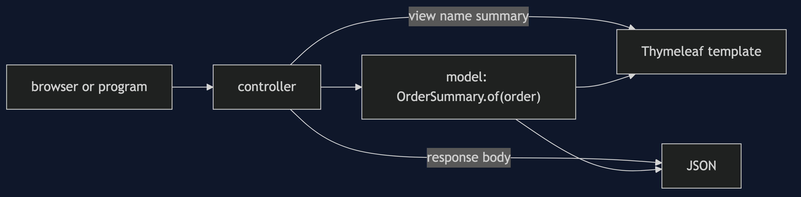
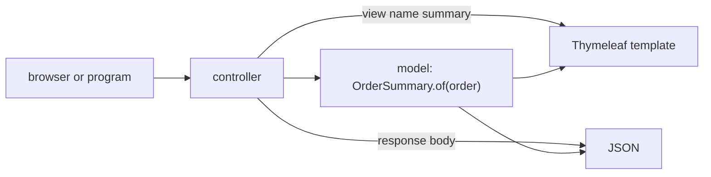

# MVC with Spring MVC Pattern — Architecture Diagram

The controller asks the model and names a view. The framework renders it.

Mermaid source

```mermaid
flowchart LR
    B["browser or program"] --> C["controller"]
    C --> M["model: OrderSummary.of(order)"]
    C -->|view name summary| V["Thymeleaf template"]
    C -->|response body| J["JSON"]
    M --> V
    M --> J
```

