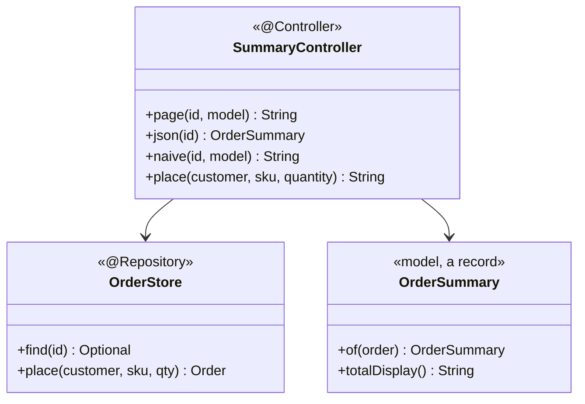

# MVC with Spring MVC Pattern — Class Diagram

The controller connects a model to a view. The model computes the total.

Mermaid source

```mermaid
classDiagram
    class SummaryController {
        <<@Controller>>
        +page(id, model) String
        +json(id) OrderSummary
        +naive(id, model) String
        +place(customer, sku, quantity) String
    }
    class OrderSummary {
        <<model, a record>>
        +of(order) OrderSummary
        +totalDisplay() String
    }
    class OrderStore {
        <<@Repository>>
        +find(id) Optional
        +place(customer, sku, qty) Order
    }
    SummaryController --> OrderStore
    SummaryController --> OrderSummary
```

