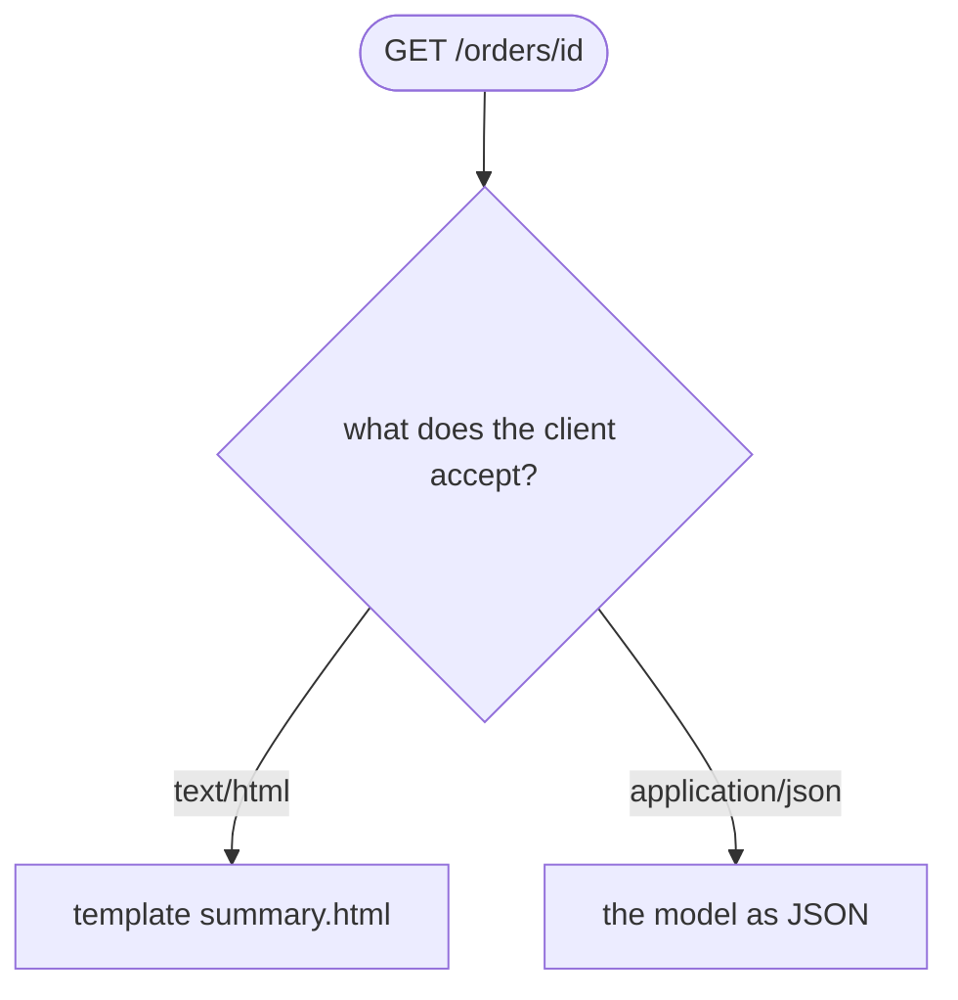

# MVC with Spring MVC Pattern — Data Flow Diagram

Which view a request gets.

Mermaid source

```mermaid
flowchart TD
    Req(["GET /orders/id"])
    Acc{"what does the client accept?"}
    Html["template summary.html"]
    Json["the model as JSON"]
    Req --> Acc
    Acc -- text/html --> Html
    Acc -- application/json --> Json
```

