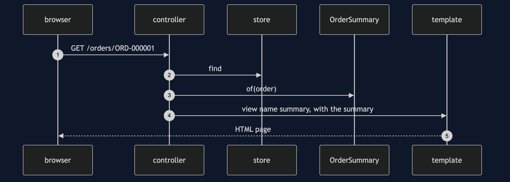
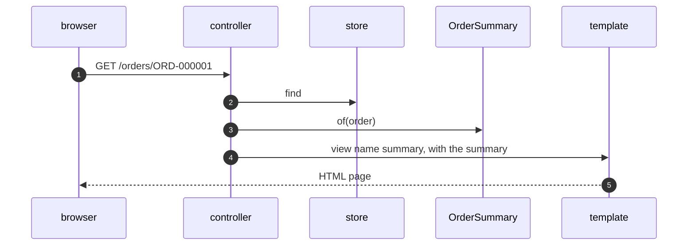

# MVC with Spring MVC Pattern — Sequence Diagram

Written for a listener with the screen off.

Say it in words. A browser sends a get for an order. The controller finds the order in the store and asks the model to build a summary. The controller puts the summary in the model map and returns the name summary. The framework finds the template with that name, fills it from the summary, and sends the page.

Mermaid source

The load-bearing sentence: **the controller names a view and never draws it.**
