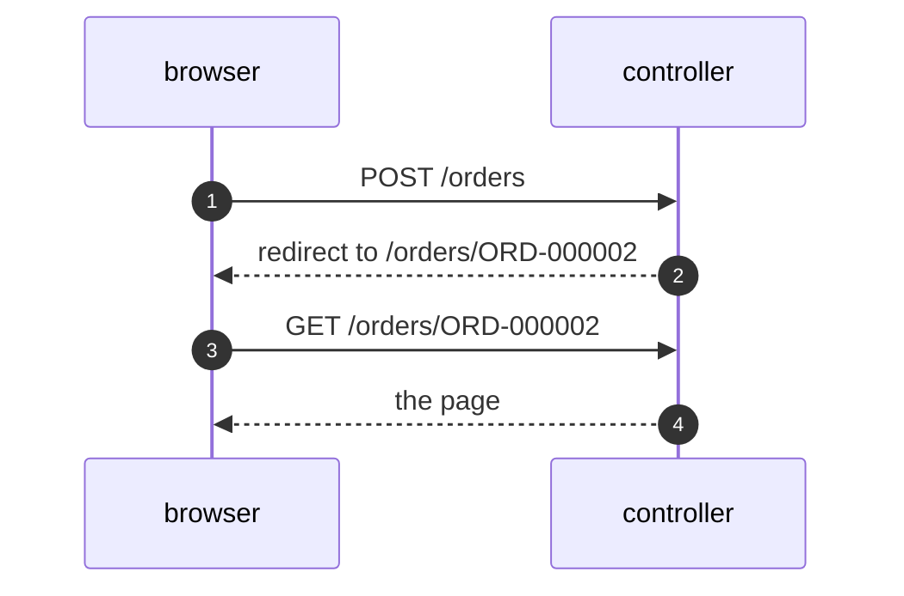

# MVC with Spring MVC Pattern — UML Sequence Diagrams

Four sequences.

## 1. Post Redirect Get

Mermaid source

```mermaid
sequenceDiagram
    autonumber
    participant B as browser
    participant C as controller
    B->>C: POST /orders
    C-->>B: redirect to /orders/ORD-000002
    B->>C: GET /orders/ORD-000002
    C-->>B: the page
```

