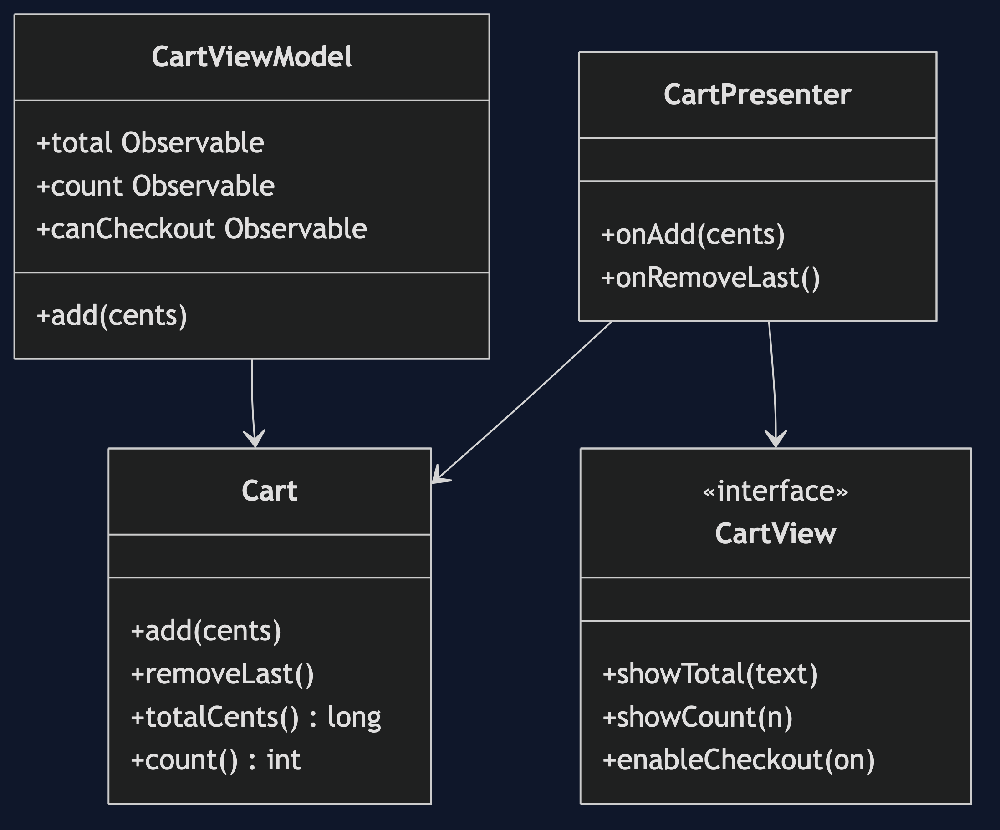
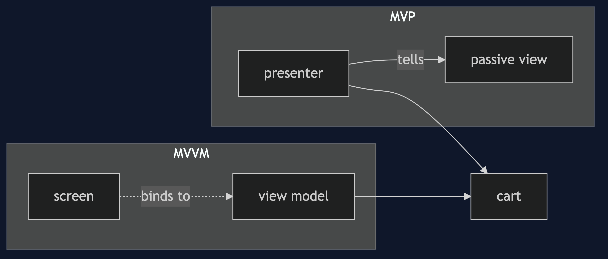
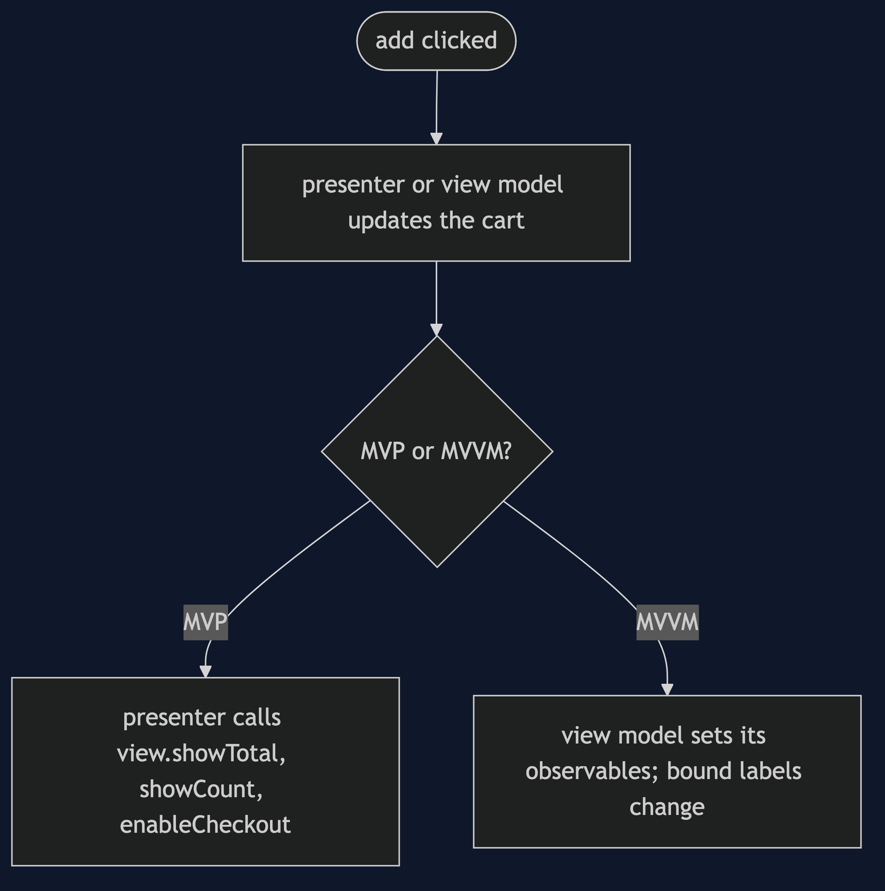
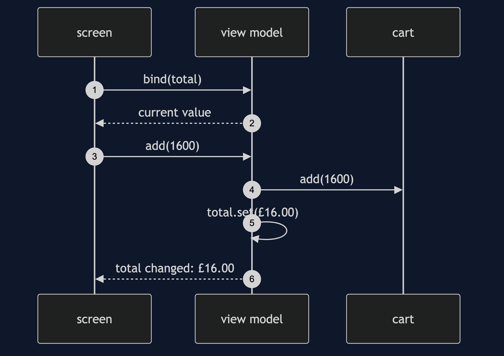
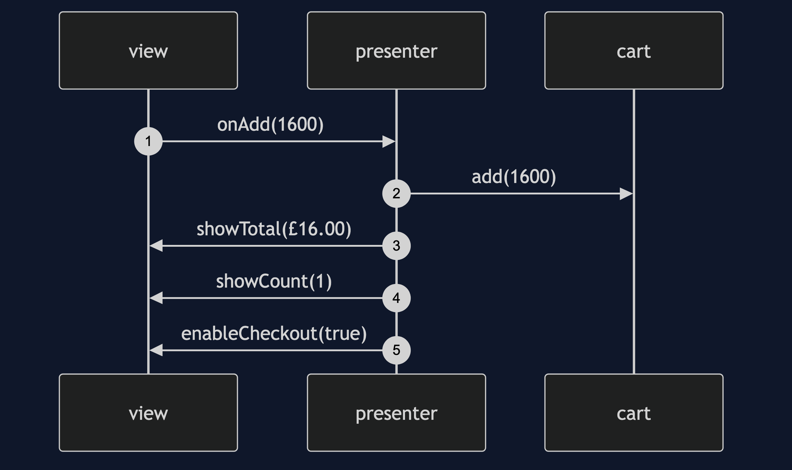

# MVP and MVVM Pattern

```
src/main/java/com/jk/explore/mvpmvvm/
├── MvpMvvmDemo.java                 the six acts
├── Cart.java                        the model
├── CartView.java                    MVP: the passive view
├── CartPresenter.java               MVP: rules, and tells the view
├── RecordingView.java               a view that writes down what it was told
├── CartViewModel.java               MVVM: state to bind to
├── Observable.java                  a value that tells its listeners
├── BoundScreen.java                 MVVM: binds once, then draws
│
├── FatCartScreen.java               the rules inside the screen
└── Window.java                      stands for a real screen
```

**MVP and MVVM: two ways to keep the rules out of the screen, by telling the view, or by letting it bind.**

This project is in [architectural-design-patterns](..). It is the next step after [MVC](../mvc-pattern): both patterns keep the model apart, and both make the rules testable with no screen.

## Run

```bash
./gradlew run
```

Six acts. Every number quoted below comes from this program's own output.

```
ONE. The screen decides.
  to check the total and the checkout rule, a screen was needed. windows opened: 1.
  total label: £16.00, checkout enabled: true. the rules are welded to the widgets.
TWO. MVP: a presenter tells a passive view.
  after two adds the view was told: [showTotal £25.50, showCount 2, enableCheckout true].
  windows opened: 0. the rules were checked with no screen.
THREE. MVP: the view makes no decisions.
  an empty cart: [showTotal £0.00, showCount 0, enableCheckout false].
  add then remove: the last three calls were [showTotal £0.00, showCount 0, enableCheckout false].
  the presenter decides checkout is off again. the view just obeys.
FOUR. MVVM: the view binds to state.
  drawn at the start: £0.00 | 0 items | checkout off.
  after two adds: £25.50 | 2 items | checkout on.
  nobody told the screen. it bound once. the view model holds no reference to any view.
FIVE. Many views, one view model.
  phone: £16.00 | 1 items | checkout on.
  watch: £16.00 | 1 items | checkout on.
  a second screen cost no change to the view model.
SIX. The bill.
  MVVM: a screen that forgot to bind the total draws: ? | 1 items | checkout on. nothing failed. it is just wrong.
  MVP: the view interface has 3 methods. each new thing on the screen adds one to the interface, the presenter and every view.
  MVVM hides the wiring in the binding. MVP spells it out, and gets long.
```

## Test

```bash
./gradlew test
```

2 test classes, 8 test methods, offline, with nothing installed and no framework.

## Technologies and versions

| What | Version | Why it is here |
| --- | --- | --- |
| Java | 21 | The repository standard, via the Gradle toolchain block |
| Gradle | 9.2.1 | The wrapper in this directory; no separate install needed |
| JUnit 5 | 5.10.2 | Test runner |

No framework. A hand-built project stays plain Java so the mechanism is the whole lesson.

## Learning Material

| Document | What it covers |
| --- | --- |
| [`docs/problem-statement.md`](docs/problem-statement.md) | The scenario, and the problem |
| [`docs/mvp-and-mvvm-pattern-explained.md`](docs/mvp-and-mvvm-pattern-explained.md) | The pattern, and six acts |
| [`docs/class-diagram.md`](docs/class-diagram.md) | The types |
| [`docs/architecture-diagram.md`](docs/architecture-diagram.md) | The parts and how they connect |
| [`docs/data-flow-diagram.md`](docs/data-flow-diagram.md) | What happens to one request |
| [`docs/sequence-diagram.md`](docs/sequence-diagram.md) | Written for a listener with the screen off |
| [`docs/uml-diagram.md`](docs/uml-diagram.md) | Four sequences |
| [`docs/animation.html`](docs/animation.html) | The six acts in a browser |
| [`docs/prerequisites.md`](docs/prerequisites.md) | What you need to know |
| [`docs/session.md`](docs/session.md) | A one-hour taught session |
| [`docs/spec.md`](docs/spec.md) | The generated specification |
| [`docs/youtube.md`](docs/youtube.md) | Title, description and chapters |

### The pattern in one picture



### Where each piece sits



### How one request moves



### Who calls whom, in order



### All four sequences




### Video

Built from [`video/scenes.py`](video/scenes.py) by
[`video/build_video.sh`](video/build_video.sh). The rendered file is not
committed; see the repository README for why.

## Where you have already met this

Android apps with ViewModel and Jetpack, WPF and .NET MAUI, SwiftUI's observable objects, and Angular and Vue with their reactive state.

## When this is too much

For a static page, or a screen with two fields, the extra layer is more than the problem. Keep it for screens with rules that you want to check on their own.

## Where this sits

This project is in [`architectural-design-patterns`](..), and is meant to be read with its neighbours there.
