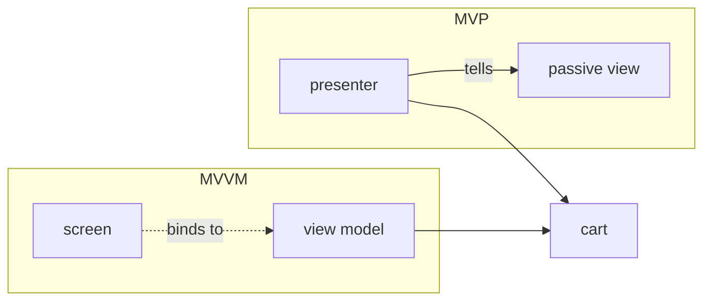

# MVP and MVVM Pattern — Architecture Diagram

MVP tells the view. MVVM lets the view bind.

Mermaid source

```mermaid
flowchart LR
    subgraph MVP
      P["presenter"] -->|tells| V["passive view"]
    end
    subgraph MVVM
      B["screen"] -.->|binds to| M["view model"]
    end
    P --> C["cart"]
    M --> C
```

