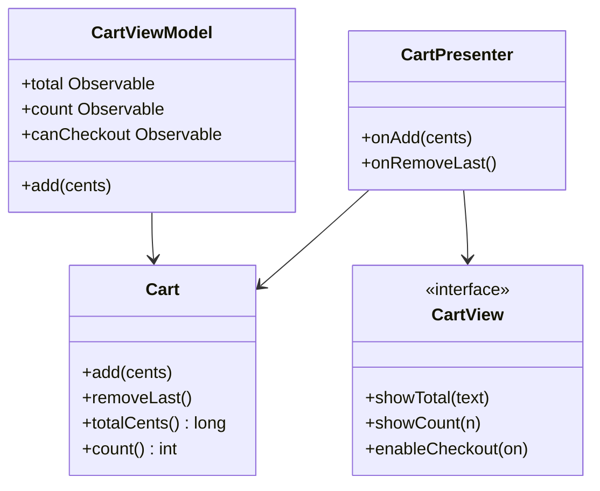

# MVP and MVVM Pattern — Class Diagram

The model, two ways to present it, and the naive screen.

Mermaid source

```mermaid
classDiagram
    class Cart {
        +add(cents)
        +removeLast()
        +totalCents() long
        +count() int
    }
    class CartPresenter {
        +onAdd(cents)
        +onRemoveLast()
    }
    class CartView {
        <<interface>>
        +showTotal(text)
        +showCount(n)
        +enableCheckout(on)
    }
    class CartViewModel {
        +total Observable
        +count Observable
        +canCheckout Observable
        +add(cents)
    }
    CartPresenter --> Cart
    CartPresenter --> CartView
    CartViewModel --> Cart
```

