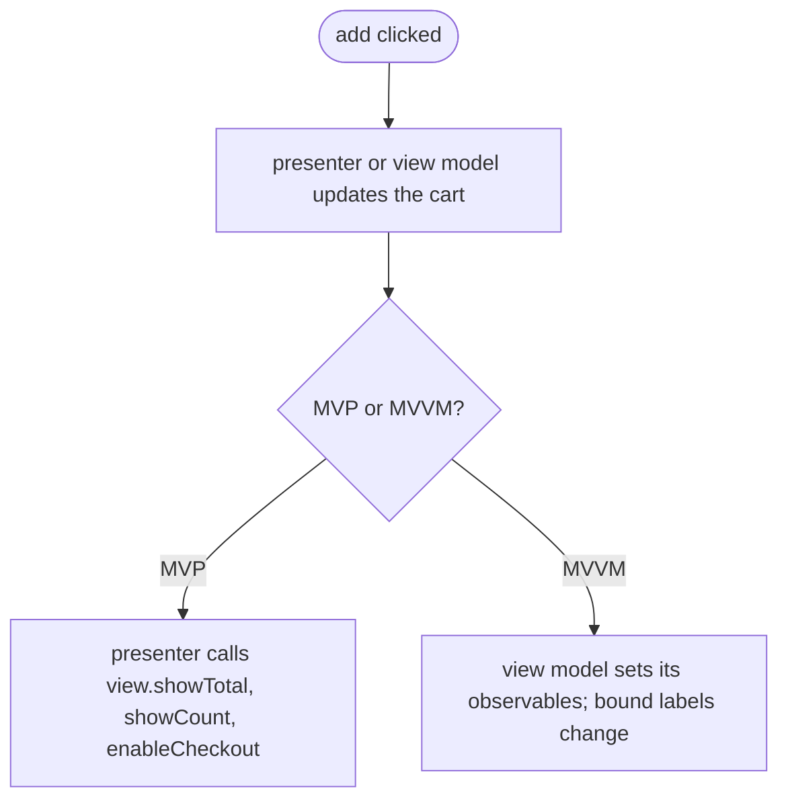

# MVP and MVVM Pattern — Data Flow Diagram

What happens when the customer adds an item.

Mermaid source

```mermaid
flowchart TD
    Click(["add clicked"])
    Rule["presenter or view model updates the cart"]
    Which{"MVP or MVVM?"}
    Tell["presenter calls view.showTotal, showCount, enableCheckout"]
    Push["view model sets its observables; bound labels change"]
    Click --> Rule --> Which
    Which -- MVP --> Tell
    Which -- MVVM --> Push
```

