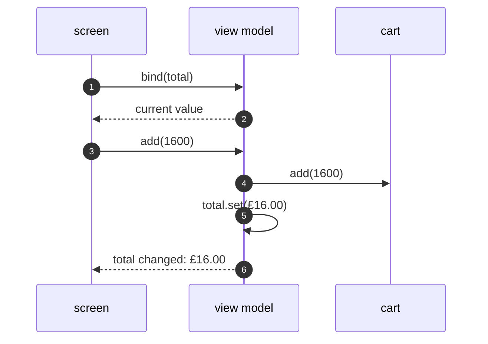

# MVP and MVVM Pattern — Sequence Diagram

Written for a listener with the screen off.

Say it in words. In M V V M, the screen binds to the view model once, at the start. Later, the customer adds an item. The view model updates the cart, and sets its total. The total has a listener, which is the screen's label, and it changes. The view model never knew the screen existed.

Mermaid source

The load-bearing sentence: **the view model pushes to whoever bound, and does not know who.**
