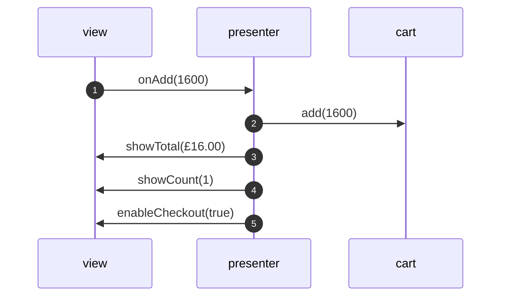

# MVP and MVVM Pattern — UML Sequence Diagrams

Four sequences.

## 1. MVP: Telling The View

Mermaid source

```mermaid
sequenceDiagram
    autonumber
    participant V as view
    participant P as presenter
    participant C as cart
    V->>P: onAdd(1600)
    P->>C: add(1600)
    P->>V: showTotal(£16.00)
    P->>V: showCount(1)
    P->>V: enableCheckout(true)
```

