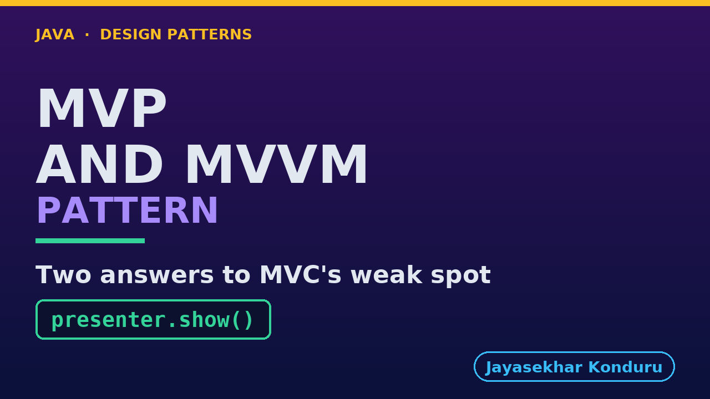

# YouTube — Mvp And Mvvm Pattern

Everything needed to publish `video/mvp-and-mvvm-pattern-explained.mp4`. Copy the fields straight out of this file.

Chapter timings are generated from the video's `.srt`. Re-run `python3 docs/make_youtube_docs.py mvp-and-mvvm` after any change to the narration, or they will be wrong.

## Title

```
MVP and MVVM
```

12 characters — under the 60 YouTube shows before truncating in search results.

## Description

The first two lines are what a viewer sees above the fold, so they carry the hook rather than the boilerplate.

```
Learn the MVP and MVVM patterns in Java with an online store cart screen that shows a total, an item count and a checkout button, and currently decides all three itself. In Model View Presenter, a presenter tells a passive screen exactly what to show, like a director calling every move from the wings. In Model View ViewModel, the screen binds to some state and updates itself whenever it changes, like actors reacting to a scoreboard. We untangle the screen both ways, show many views sharing one view model, and compare the costs: a longer interface on one side, and hidden wiring on the other.

CHAPTERS
00:00 Introduction
01:03 The Scenario
01:20 The Screen Decides
01:36 The Pattern
01:57 A Presenter Tells A Passive View
02:21 The View Makes No Decisions
02:42 The View Binds To State
03:08 Many Views, One View Model
03:25 The Bill
03:57 How To Recognise It
04:24 The Verdict
04:49 What Is Real Here
05:02 When This Is Too Much
05:15 Thanks for Watching

SOURCE CODE, WRITTEN NOTES AND AN INTERACTIVE ANIMATION
https://github.com/jk-boot-up/java-design-patterns/tree/main/gradle-java/architectural-design-patterns/mvp-and-mvvm-pattern

WHAT YOU NEED FIRST
Java 21 and a working knowledge of classes and interfaces. No prior design-pattern knowledge is assumed. The full prerequisites are in docs/prerequisites.md in the repository.
```

## Chapters

YouTube renders these as chapters only if there are at least three and the first is at `00:00`.

```
00:00 Introduction
01:03 The Scenario
01:20 The Screen Decides
01:36 The Pattern
01:57 A Presenter Tells A Passive View
02:21 The View Makes No Decisions
02:42 The View Binds To State
03:08 Many Views, One View Model
03:25 The Bill
03:57 How To Recognise It
04:24 The Verdict
04:49 What Is Real Here
05:02 When This Is Too Much
05:15 Thanks for Watching
```

## Tags

```
mvp, mvvm, architecture patterns, design patterns, java design patterns, gang of four, java 21, software design, clean code, object oriented design, java tutorial, ecommerce, programming tutorial
```

195 characters, under YouTube's 500 limit.

## Thumbnail



**Upload `docs/thumbnail.png`** — 1280×720, the size YouTube recommends, generated by `docs/make_thumbnails.py`. It is deliberately not the same image as the video's opening frame: a thumbnail is judged at about 360 pixels wide in a search result, so this one carries only the pattern name, one line of promise and one short piece of code, each set large enough to survive the shrink.

`video/poster.png` is the 1920×1080 opening frame, produced by the video build. It stays in the repository as the title card; it is not what gets uploaded.

YouTube will not pick the thumbnail up on its own — upload it under **Details → Thumbnail → Upload file**. A custom thumbnail requires a verified channel.

## Upload checklist

- [ ] Upload `video/mvp-and-mvvm-pattern-explained.mp4` (1080p, H.264, 30 fps, AAC 48 kHz — already YouTube's recommended settings, no re-encode needed)
- [ ] Set the video language to **English** first, or the subtitle option may not appear
- [ ] Add subtitles: *Video elements → Add subtitles → Upload file → With timing* → `video/mvp-and-mvvm-pattern-explained.srt`
- [ ] Upload `docs/thumbnail.png` as the thumbnail — do not let YouTube auto-pick a frame
- [ ] Paste the title, description and tags from above
- [ ] Add to the **Java Design Patterns** playlist, in learning order
- [ ] Wait for 1080p processing before sharing the link — code slides are unreadable at 360p

## Cards and end screen

End screen links to whichever pattern video goes up next — set it at upload time rather than assuming an order.

Add a card partway through pointing at the playlist, so a viewer who arrives at this pattern from search can find the rest of the series.

## Runtime

Approximately 05:56, narrated at 145 words per minute.
