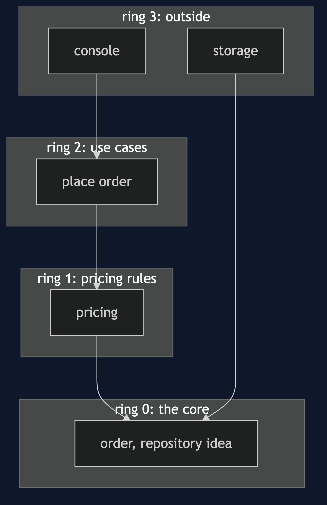
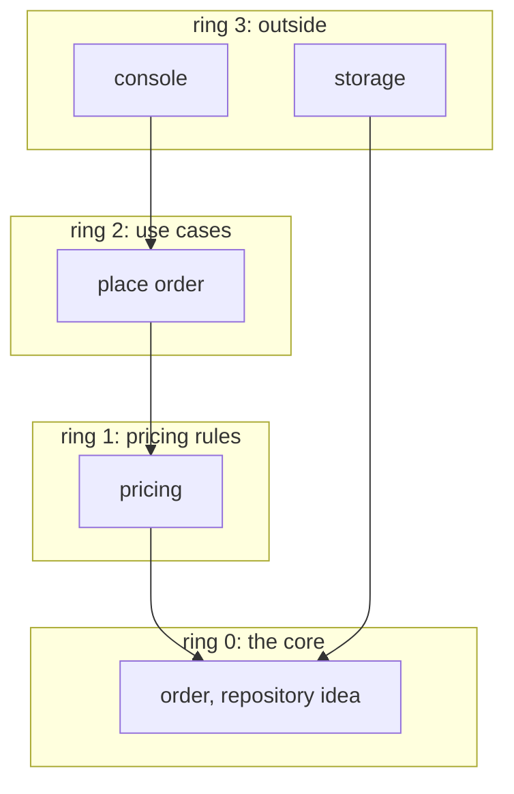

# Onion Architecture Pattern — Architecture Diagram

The rings, from the centre outward. Every arrow points inward.

Mermaid source

```mermaid
flowchart TB
    subgraph R3["ring 3: outside"]
      U["console"]
      S["storage"]
    end
    subgraph R2["ring 2: use cases"]
      A["place order"]
    end
    subgraph R1["ring 1: pricing rules"]
      P["pricing"]
    end
    subgraph R0["ring 0: the core"]
      O["order, repository idea"]
    end
    U --> A --> P --> O
    S --> O
```

