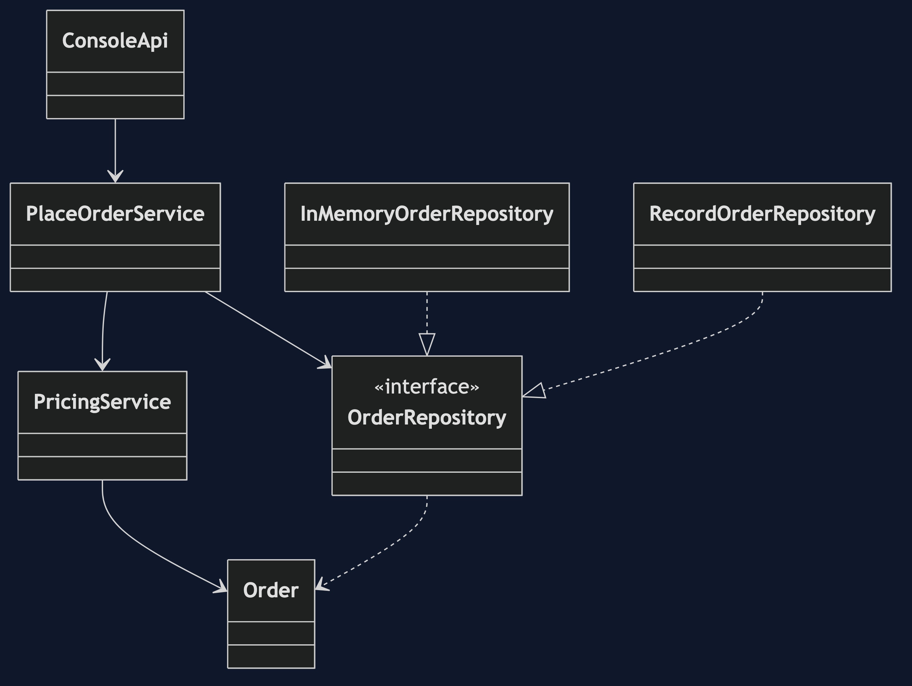
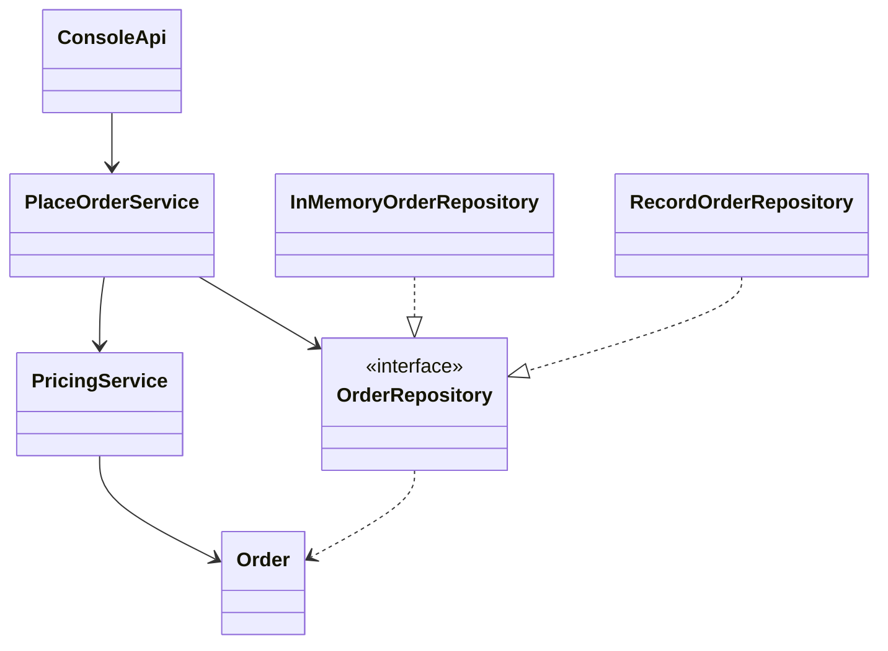

# Onion Architecture Pattern — Class Diagram

Rings of classes. Arrows point inward.

Mermaid source

```mermaid
classDiagram
    class Order
    class OrderRepository {
        <<interface>>
    }
    class PricingService
    class PlaceOrderService
    class InMemoryOrderRepository
    class RecordOrderRepository
    class ConsoleApi
    PricingService --> Order
    PlaceOrderService --> PricingService
    PlaceOrderService --> OrderRepository
    OrderRepository ..> Order
    InMemoryOrderRepository ..|> OrderRepository
    RecordOrderRepository ..|> OrderRepository
    ConsoleApi --> PlaceOrderService
```

