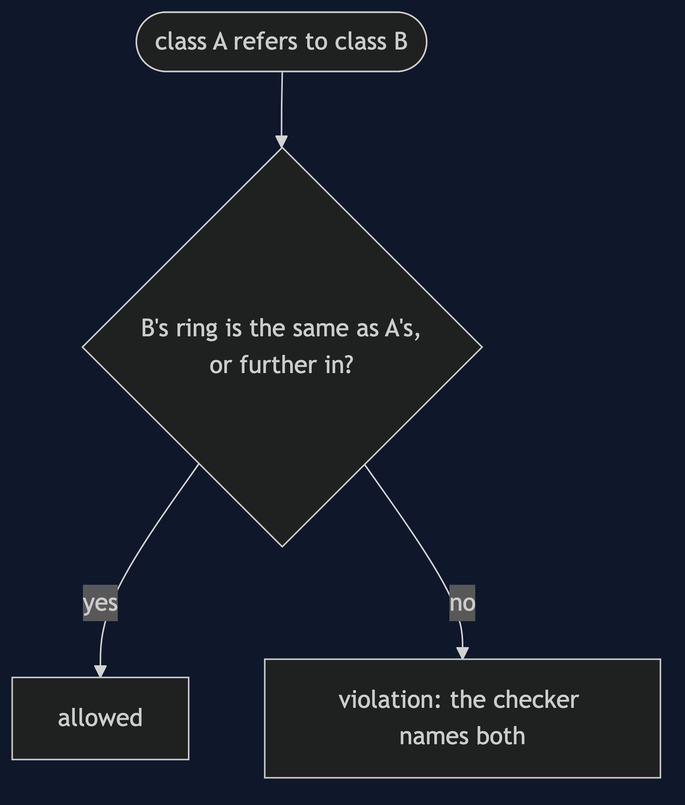
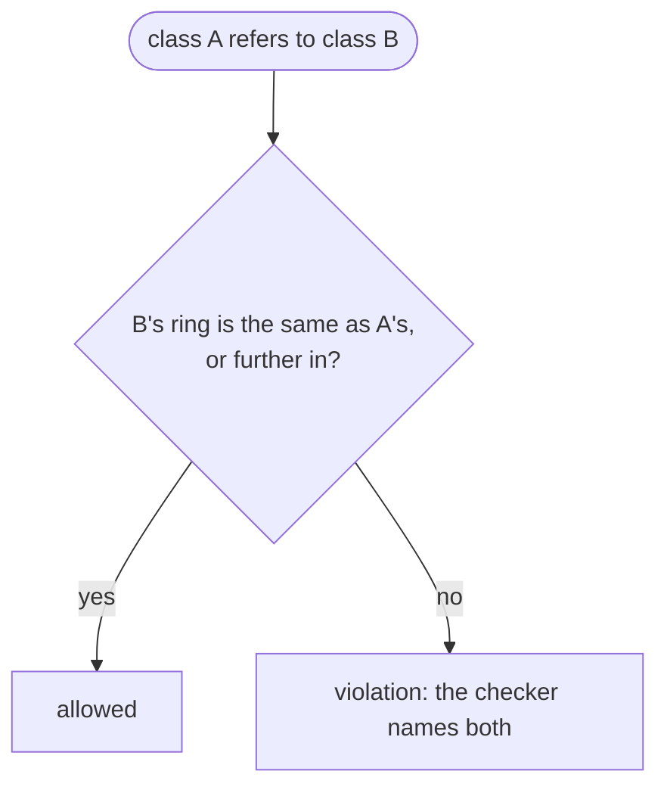

# Onion Architecture Pattern — Data Flow Diagram

The dependency rule, applied to one reference.

Mermaid source

```mermaid
flowchart TD
    Ref(["class A refers to class B"])
    Same{"B's ring is the same as A's,\nor further in?"}
    Ok["allowed"]
    Bad["violation: the checker names both"]
    Ref --> Same
    Same -- yes --> Ok
    Same -- no --> Bad
```

