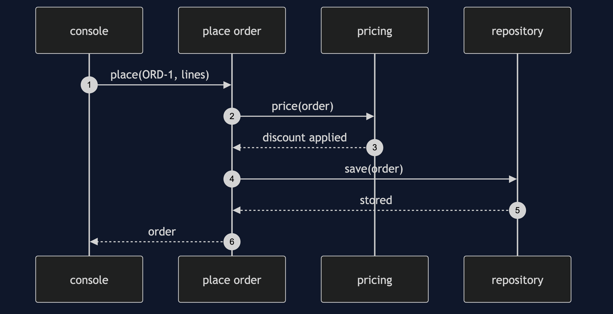
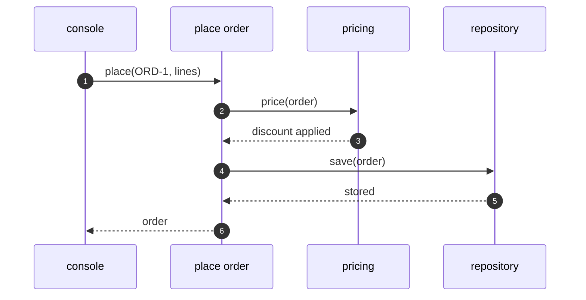

# Onion Architecture Pattern — Sequence Diagram

Written for a listener with the screen off.

Say it in words. The console gets a line of text and calls the use case. The use case builds an order, asks the pricing rule to price it, and gives it to the repository, which it knows only as an idea. The real storage, on the outside, keeps it. The storage refers to the order, and the order never refers to the storage.

Mermaid source

The load-bearing sentence: **the repository is an idea to the inside, and a real store on the outside.**
