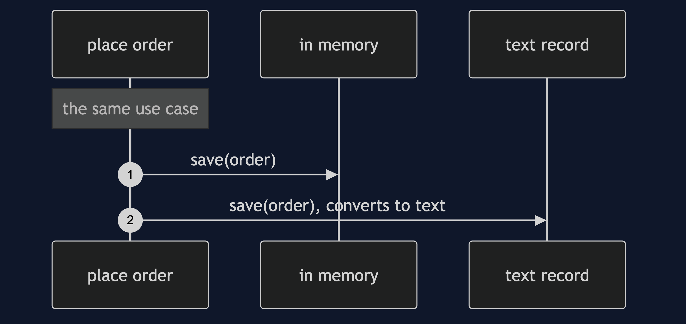
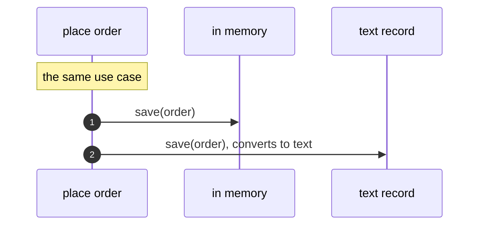

# Onion Architecture Pattern — UML Sequence Diagrams

Four sequences.

## 1. Swapping Storage

Mermaid source

```mermaid
sequenceDiagram
    autonumber
    participant A as place order
    participant M as in memory
    participant F as text record
    Note over A: the same use case
    A->>M: save(order)
    A->>F: save(order), converts to text
```

