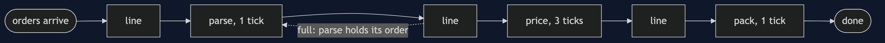
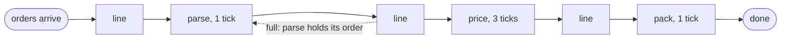

# Pipe and Filter Architecture Pattern — Architecture Diagram

Three stages, each with a waiting line in front, and a limit that pushes back.

Mermaid source

```mermaid
flowchart LR
    Door(["orders arrive"]) --> Q1["line"] --> P["parse, 1 tick"]
    P --> Q2["line"] --> R["price, 3 ticks"]
    R --> Q3["line"] --> K["pack, 1 tick"] --> Out(["done"])
    Q2 -. full: parse holds its order .-> P
```

