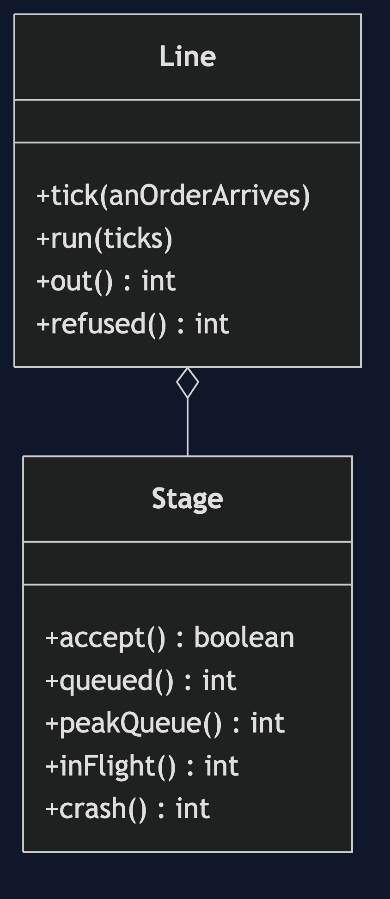
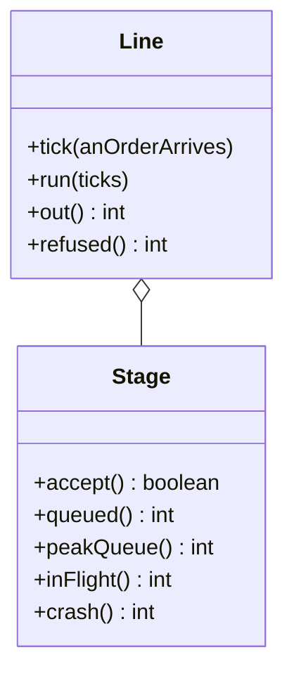

# Pipe and Filter Architecture Pattern — Class Diagram

A line of stages, each with a waiting line and workers.

Mermaid source

```mermaid
classDiagram
    class Line {
        +tick(anOrderArrives)
        +run(ticks)
        +out() int
        +refused() int
    }
    class Stage {
        +accept() boolean
        +queued() int
        +peakQueue() int
        +inFlight() int
        +crash() int
    }
    Line o-- Stage
```

