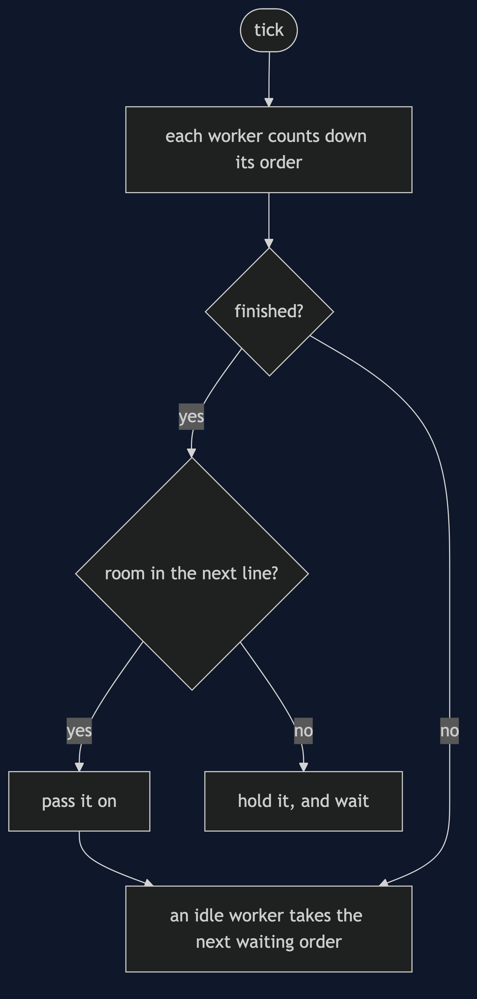
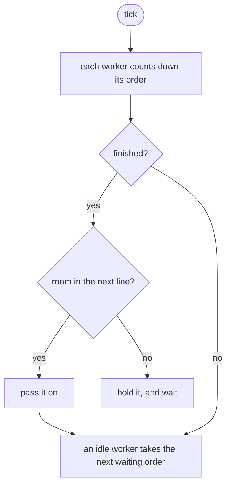

# Pipe and Filter Architecture Pattern — Data Flow Diagram

What a stage does on each tick.

Mermaid source

```mermaid
flowchart TD
    Tick(["tick"])
    Work["each worker counts down its order"]
    Fin{"finished?"}
    Next{"room in the next line?"}
    Pass["pass it on"]
    Hold["hold it, and wait"]
    Take["an idle worker takes the next waiting order"]
    Tick --> Work --> Fin
    Fin -- yes --> Next
    Next -- yes --> Pass --> Take
    Next -- no --> Hold
    Fin -- no --> Take
```

