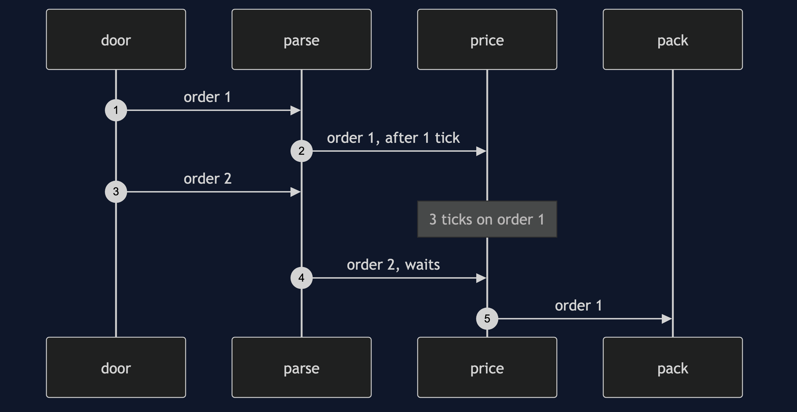
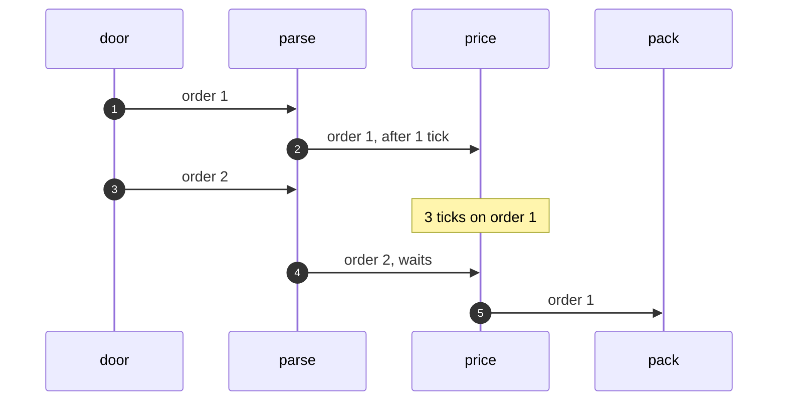

# Pipe and Filter Architecture Pattern — Sequence Diagram

Written for a listener with the screen off.

Say it in words. An order arrives, and waits in front of parse. Parse takes it, and takes one tick. It passes to the line in front of price. Price takes three ticks. While price works on it, parse is already working on the next order. The order then passes to pack, and comes out.

Mermaid source

The load-bearing sentence: **each stage works on a different order at the same moment.**
