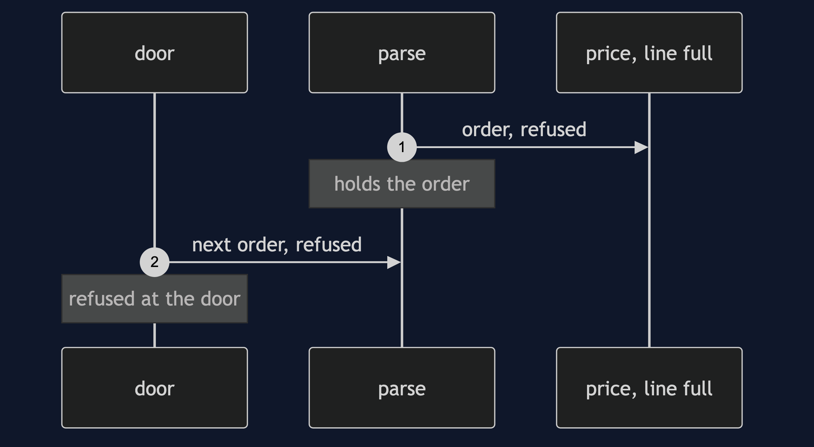
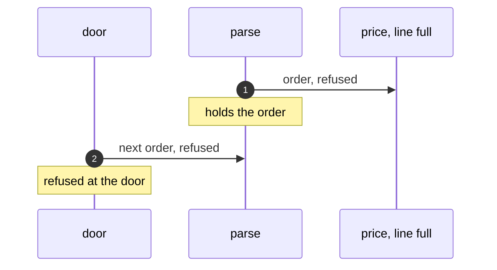

# Pipe and Filter Architecture Pattern — UML Sequence Diagrams

Four sequences.

## 1. Backpressure

Mermaid source

```mermaid
sequenceDiagram
    autonumber
    participant D as door
    participant P as parse
    participant R as price, line full
    P->>R: order, refused
    Note over P: holds the order
    D->>P: next order, refused
    Note over D: refused at the door
```

