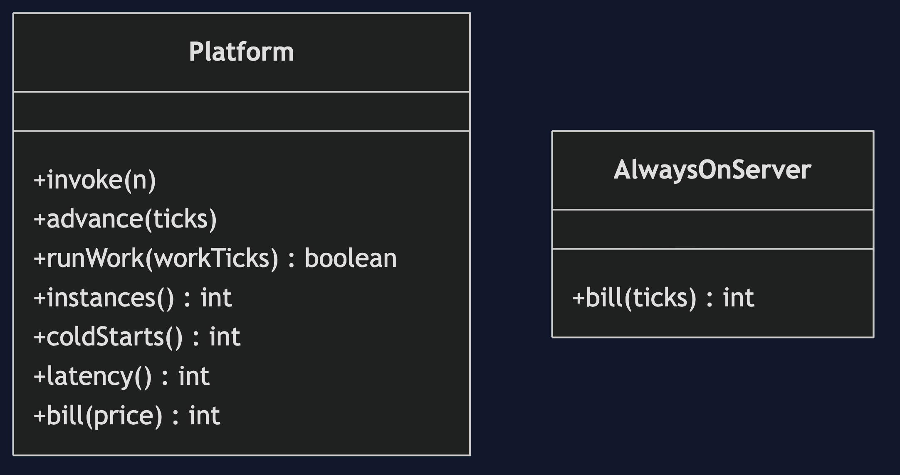
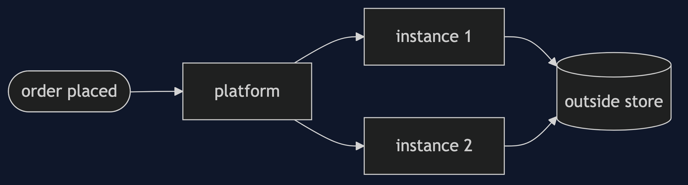
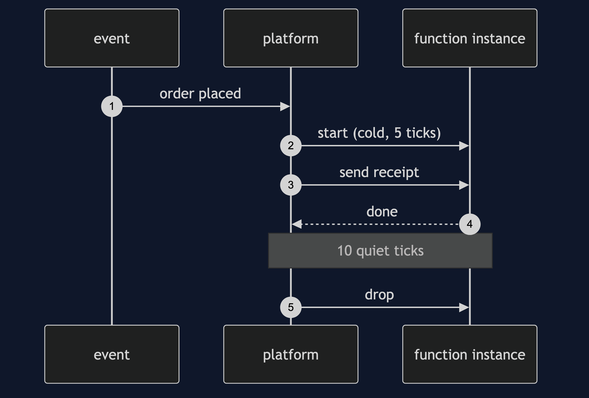

# Serverless Pattern

```
src/main/java/com/jk/explore/serverless/
├── ServerlessDemo.java              the six acts
├── Platform.java                    starts, keeps warm, and drops instances; counts calls
│
└── AlwaysOnServer.java              the machine that is paid for all the time
```

**Serverless: short functions started by events, dropped when idle, and paid for per call.**

This project is in [architectural-design-patterns](..). It is [Event-Driven Architecture](../event-driven-architecture-pattern) with the servers taken away, and it is the platform behind [Claim Check](../../micro-services-design-patterns/claim-check-pattern) style file handling and small queue workers.

## Run

```bash
./gradlew run
```

Six acts. Every number quoted below comes from this program's own output.

```
ONE. A machine that is always on.
  100 ticks, 3 orders. the bill: 200. paid for 100 ticks, used for 3 orders.
TWO. A function per event.
  the same 3 orders, each one runs a send-receipt function. invocations: 3. the bill at 1 per invocation: 3.
  between orders nothing runs, and nothing is paid for.
THREE. Scale out, and back to zero.
  before any order, instances: 0.
  5 orders at the same moment: instances 5, cold starts 5.
  10 ticks later, with no orders: instances 0.
FOUR. The cold start.
  extra wait: first call 5 ticks, a call soon after 0, a call after a long quiet 5.
  the first call after a quiet time is slow, because an instance must be started for it.
FIVE. No memory between calls.
  two calls in a row: the instance remembers 2, the outside store 2.
  after the quiet time: the instance remembers 1, the outside store 3.
  what is kept in the function is gone. anything that must last goes in a store outside.
SIX. The bill.
  100 ticks. quiet, 3 calls: functions 3, server 200. busy, 300 calls: functions 300, server 200.
  paying per call is cheap when quiet and dear when busy all the time.
  and a job of 20 ticks against a limit of 15: finished false. long work does not fit.
```

## Test

```bash
./gradlew test
```

2 test classes, 7 test methods, offline, with nothing installed and no framework.

## Technologies and versions

| What | Version | Why it is here |
| --- | --- | --- |
| Java | 21 | The repository standard, via the Gradle toolchain block |
| Gradle | 9.2.1 | The wrapper in this directory; no separate install needed |
| JUnit 5 | 5.10.2 | Test runner |

No framework. A hand-built project stays plain Java so the mechanism is the whole lesson.

## Learning Material

| Document | What it covers |
| --- | --- |
| [`docs/problem-statement.md`](docs/problem-statement.md) | The scenario, and the problem |
| [`docs/serverless-pattern-explained.md`](docs/serverless-pattern-explained.md) | The pattern, and six acts |
| [`docs/class-diagram.md`](docs/class-diagram.md) | The types |
| [`docs/architecture-diagram.md`](docs/architecture-diagram.md) | The parts and how they connect |
| [`docs/data-flow-diagram.md`](docs/data-flow-diagram.md) | What happens to one request |
| [`docs/sequence-diagram.md`](docs/sequence-diagram.md) | Written for a listener with the screen off |
| [`docs/uml-diagram.md`](docs/uml-diagram.md) | Four sequences |
| [`docs/animation.html`](docs/animation.html) | The six acts in a browser |
| [`docs/prerequisites.md`](docs/prerequisites.md) | What you need to know |
| [`docs/session.md`](docs/session.md) | A one-hour taught session |
| [`docs/spec.md`](docs/spec.md) | The generated specification |
| [`docs/youtube.md`](docs/youtube.md) | Title, description and chapters |

### The pattern in one picture



### Where each piece sits



### How one request moves


### Who calls whom, in order



### All four sequences


### Video

Built from [`video/scenes.py`](video/scenes.py) by
[`video/build_video.sh`](video/build_video.sh). The rendered file is not
committed; see the repository README for why.

## Where you have already met this

Image resizing on upload, sending receipts, webhooks, scheduled clean-ups, and small APIs behind a gateway.

## When this is too much

For steady heavy load, long jobs, or work that needs memory between calls, an ordinary server is cheaper and simpler. Serverless suits the quiet and the bursty.

## Where this sits

This project is in [`architectural-design-patterns`](..), and is meant to be read with its neighbours there.
