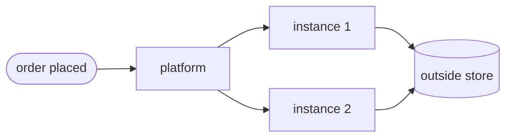

# Serverless Pattern — Architecture Diagram

Events start functions. The platform adds and removes instances.

Mermaid source

```mermaid
flowchart LR
    E(["order placed"]) --> P["platform"]
    P --> F1["instance 1"]
    P --> F2["instance 2"]
    F1 --> S[("outside store")]
    F2 --> S
```

