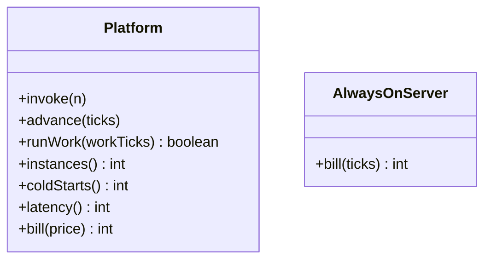

# Serverless Pattern — Class Diagram

A platform that keeps instances, and a server for comparison.

Mermaid source

```mermaid
classDiagram
    class Platform {
        +invoke(n)
        +advance(ticks)
        +runWork(workTicks) boolean
        +instances() int
        +coldStarts() int
        +latency() int
        +bill(price) int
    }
    class AlwaysOnServer {
        +bill(ticks) int
    }
```

