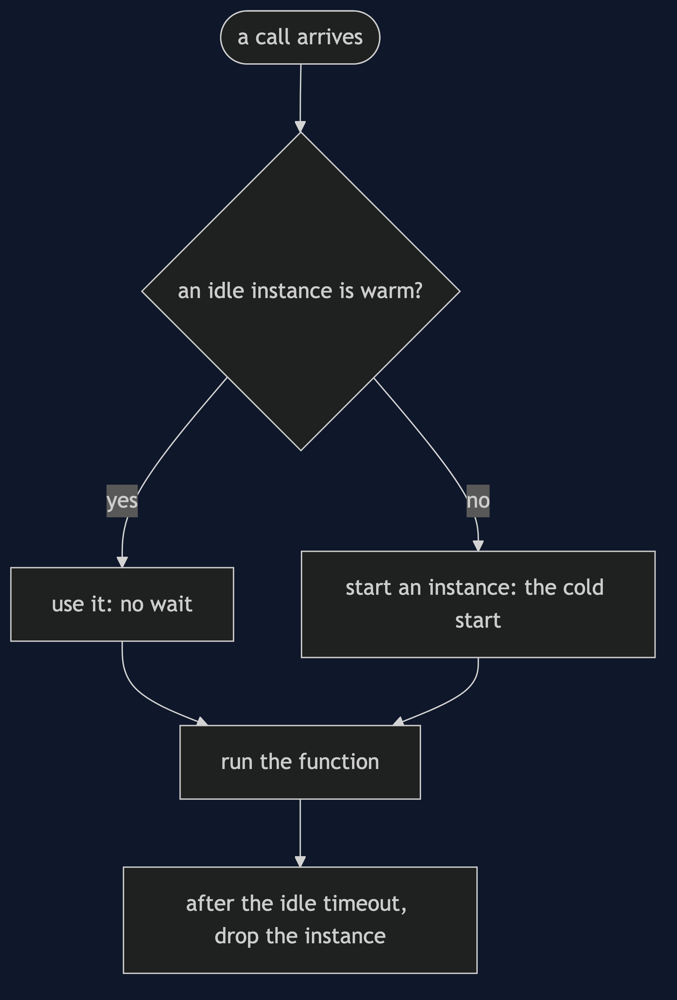
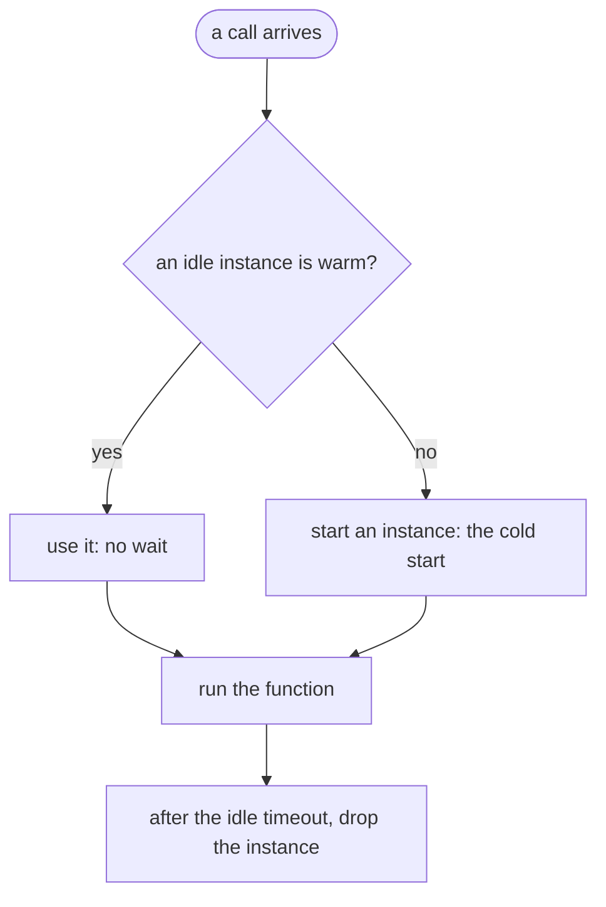

# Serverless Pattern — Data Flow Diagram

What the platform does with one call.

Mermaid source

```mermaid
flowchart TD
    Call(["a call arrives"])
    Warm{"an idle instance is warm?"}
    Use["use it: no wait"]
    Start["start an instance: the cold start"]
    Run["run the function"]
    Idle["after the idle timeout, drop the instance"]
    Call --> Warm
    Warm -- yes --> Use --> Run
    Warm -- no --> Start --> Run
    Run --> Idle
```

