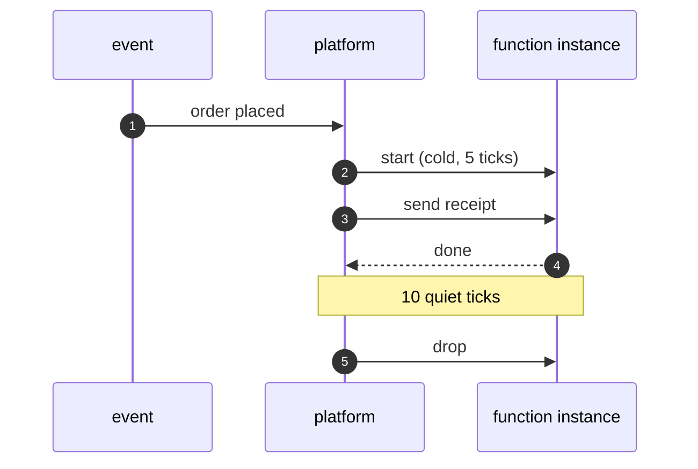

# Serverless Pattern — Sequence Diagram

Written for a listener with the screen off.

Say it in words. An order is placed, and the platform gets an event. There is no warm instance, so it starts one, which takes five ticks. It runs the send receipt function. Ten ticks later, with nothing more to do, it throws the instance away. The next order starts another.

Mermaid source

The load-bearing sentence: **the platform starts and drops instances, and the function only handles the event.**
