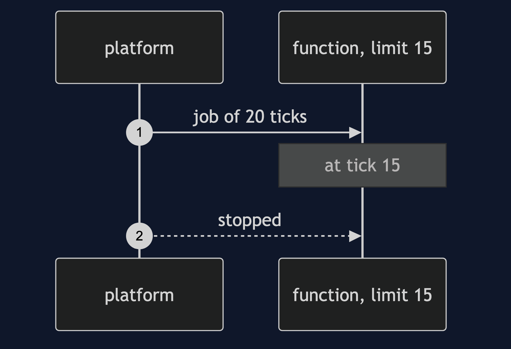
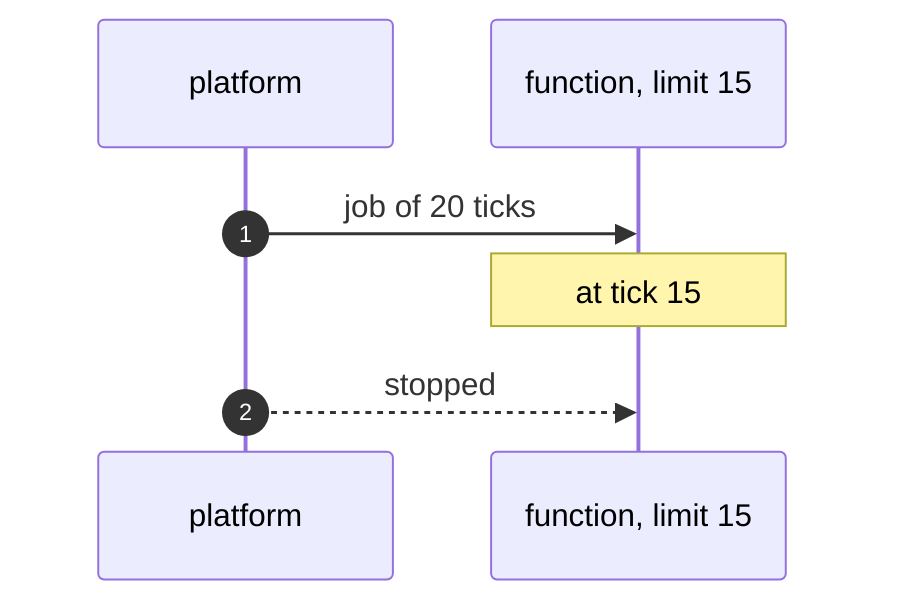

# Serverless Pattern — UML Sequence Diagrams

Four sequences.

## 1. A Time Limit

Mermaid source

```mermaid
sequenceDiagram
    autonumber
    participant P as platform
    participant F as function, limit 15
    P->>F: job of 20 ticks
    Note over F: at tick 15
    P-->>F: stopped
```

