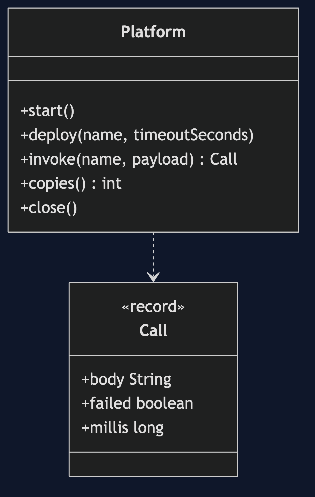
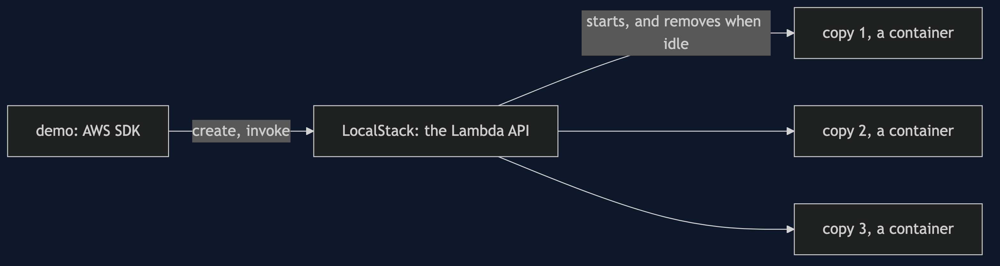
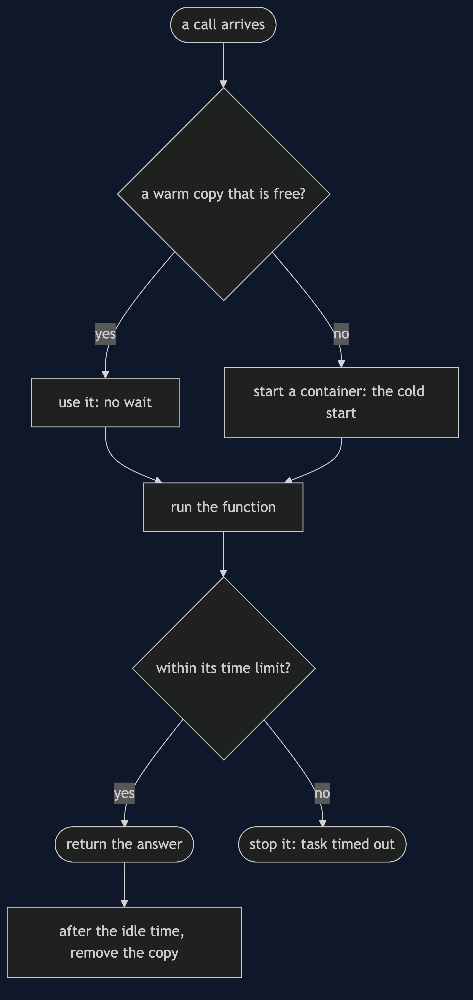
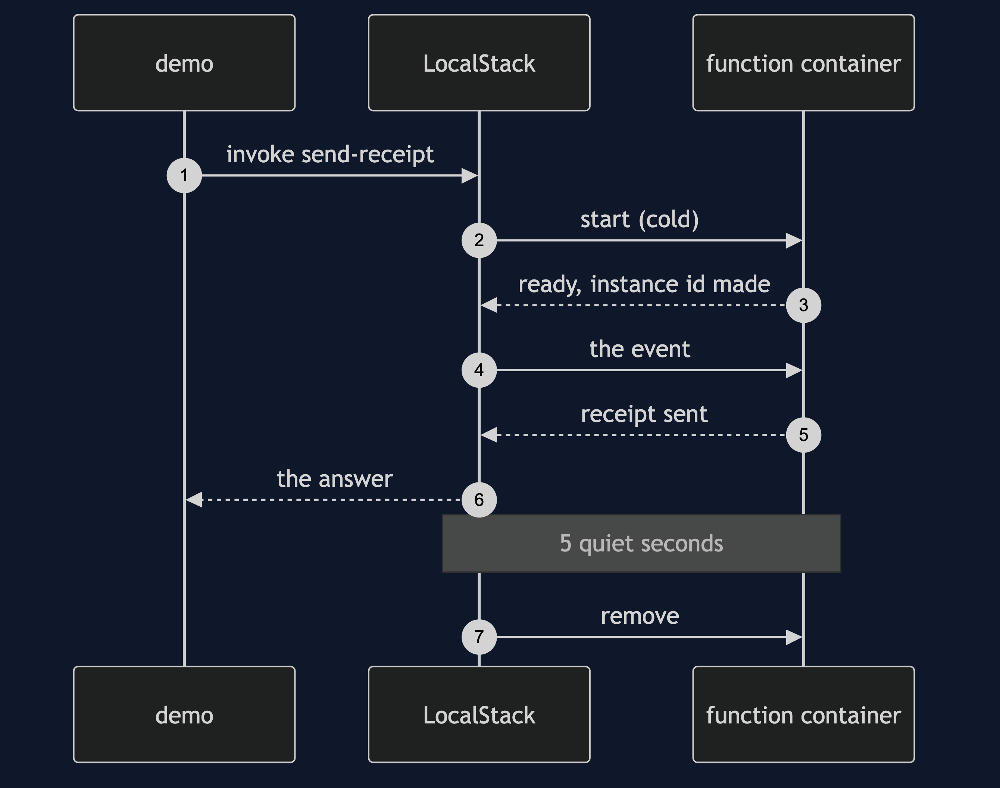
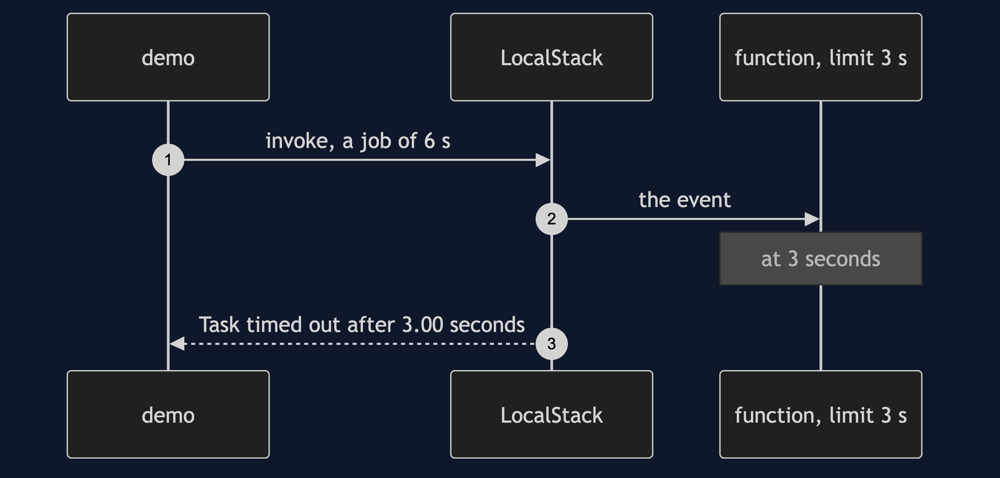

# Serverless with LocalStack Pattern

```
src/main/java/com/jk/explore/serverlessls/
├── ServerlessLsDemo.java        the six acts
├── Platform.java                runs LocalStack; uploads, invokes and counts copies of the function
├── Shell.java                   runs docker
src/main/resources/
└── handler.py                   the receipt function, in Python
```

**With Lambda, a function is a container the platform starts on demand, and throws away when idle.**

This project is the framework version of [Serverless](../serverless-pattern). That project built the mechanism by hand. This one shows the same idea inside LocalStack and AWS Lambda. It does not re-teach the pattern. It shows what LocalStack and AWS Lambda adds, the failures that are its own, and what it costs.

## Run

```bash
./gradlew run
```

Six acts. The partner project, Serverless, built the mechanism by hand. Here the same idea runs through LocalStack and AWS Lambda, and every count comes from real output.

```
ONE. A machine that is always on.
  in the earlier project's price units, a server costs 2 a tick. 100 ticks with 3 orders: 200. paid for 100 ticks, used for 3 orders.
TWO. A function per event.
  the function was uploaded to a real Lambda API, and run for each of 3 orders. receipts sent: 3. the bill at 1 per call: 3.
  between orders nothing has to be running, and nothing is paid for.
THREE. Scale out, and back to zero.
  before any order, copies running: 0.
  5 orders at the same moment: distinct copies that answered 5, copies running 5.
  5 quiet seconds later, with no orders: copies running 0.
FOUR. The cold start.
  the first call after a quiet time took 768 ms, and the call right after it 14 ms. the cold call was slower: true.
  the first call had to start a container for the function, and the second found it running.
FIVE. No memory between calls.
  a call to the copy that is running: it has handled 3 calls, in copy 5e680365.
  after the quiet time: it has handled 1 calls. a different copy answered: true.
  what the first copy kept in its variables went with it. anything that must last goes in a store outside.
SIX. The bill.
  in price units, 100 ticks. quiet, 3 calls: functions 3, server 200. busy, 300 calls: functions 300, server 200.
  paying per call is cheap when quiet and dear when busy all the time.
  a job that needs 6 seconds, with a limit of 3: failed true, and the platform said: Task timed out after 3.00 seconds.
```

## Test

```bash
./gradlew test
```

2 test classes, 4 test methods, offline, with each Spring context started inside the test, and no server.

## Technologies and versions

| What | Version | Why it is here |
| --- | --- | --- |
| Java | 21 | The repository standard, via the Gradle toolchain block |
| Gradle | 9.2.1 | The wrapper in this directory |
| Docker | 24+ | Runs LocalStack and the function containers |
| LocalStack | 4.14.0 | The Lambda API, locally |
| Lambda runtime | python 3.12 | Runs the receipt function |
| AWS SDK for Java | 2.55.1 | Calls the Lambda API |
| JUnit 5 | 5.10.2 | Test runner; the Lambda test is skipped when Docker is missing |

See [`docs/dependencies.md`](docs/dependencies.md).

## Learning Material

| Document | What it covers |
| --- | --- |
| [`docs/problem-statement.md`](docs/problem-statement.md) | The partner's counted platform, and what is new |
| [`docs/serverless-with-localstack-pattern-explained.md`](docs/serverless-with-localstack-pattern-explained.md) | A real Lambda API, and real containers |
| [`docs/class-diagram.md`](docs/class-diagram.md) | The types |
| [`docs/architecture-diagram.md`](docs/architecture-diagram.md) | The demo, LocalStack and the copies |
| [`docs/data-flow-diagram.md`](docs/data-flow-diagram.md) | What the platform does with a call |
| [`docs/sequence-diagram.md`](docs/sequence-diagram.md) | Written for a listener with the screen off |
| [`docs/uml-diagram.md`](docs/uml-diagram.md) | Four sequences |
| [`docs/animation.html`](docs/animation.html) | The six acts in a browser |
| [`docs/prerequisites.md`](docs/prerequisites.md) | What you need to know |
| [`docs/session.md`](docs/session.md) | A one-hour taught session |
| [`docs/spec.md`](docs/spec.md) | The generated specification |
| [`docs/youtube.md`](docs/youtube.md) | Title, description and chapters |
| [`docs/dependencies.md`](docs/dependencies.md) | What LocalStack and AWS Lambda is, what it costs, and that skipping this project loses none of the pattern |

### The pattern in one picture



### Where each piece sits



### How one request moves



### Who calls whom, in order



### All four sequences



### Video

Built from [`video/scenes.py`](video/scenes.py) by
[`video/build_video.sh`](video/build_video.sh). The rendered file is not
committed; see the repository README for why.

## Where you have already met this

AWS Lambda, Google Cloud Functions and Azure Functions, and image resizing, receipts and webhooks.

## When this is too much

For steady heavy load, long jobs, or work that needs memory between calls, an ordinary server is cheaper and simpler.

## Where this sits

This project pairs with [Serverless](../serverless-pattern), and is a framework version in [`architectural-design-patterns`](..).
