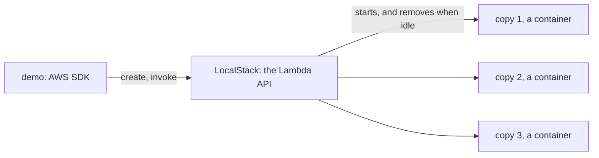

# Serverless with LocalStack Pattern — Architecture Diagram

The demo calls the Lambda API. LocalStack starts a container for each copy.

Mermaid source

```mermaid
flowchart LR
    D["demo: AWS SDK"] -->|create, invoke| L["LocalStack: the Lambda API"]
    L -->|starts, and removes when idle| C1["copy 1, a container"]
    L --> C2["copy 2, a container"]
    L --> C3["copy 3, a container"]
```

