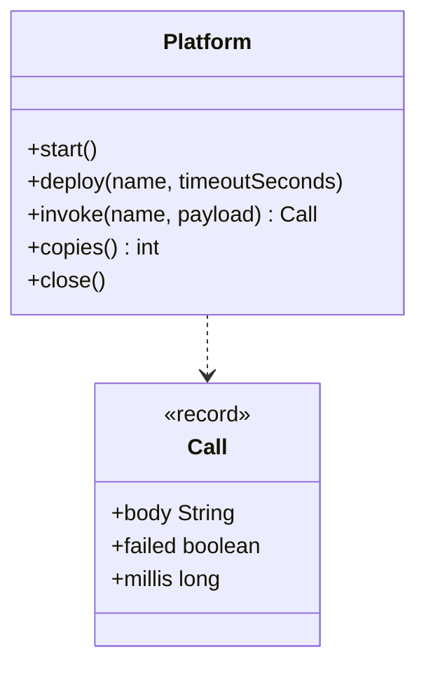

# Serverless with LocalStack Pattern — Class Diagram

A platform object drives LocalStack. The function is a Python file.

Mermaid source

```mermaid
classDiagram
    class Platform {
        +start()
        +deploy(name, timeoutSeconds)
        +invoke(name, payload) Call
        +copies() int
        +close()
    }
    class Call {
        <<record>>
        +body String
        +failed boolean
        +millis long
    }
    Platform ..> Call
```

