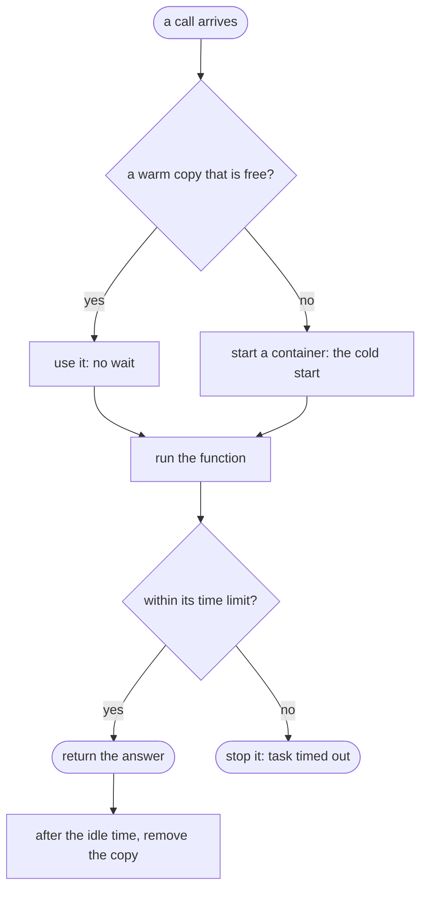

# Serverless with LocalStack Pattern — Data Flow Diagram

What the platform does with a call.

Mermaid source

```mermaid
flowchart TD
    Call(["a call arrives"])
    Free{"a warm copy that is free?"}
    Use["use it: no wait"]
    Start["start a container: the cold start"]
    Run["run the function"]
    Limit{"within its time limit?"}
    Ok(["return the answer"])
    Stop(["stop it: task timed out"])
    Idle["after the idle time, remove the copy"]
    Call --> Free
    Free -- yes --> Use --> Run
    Free -- no --> Start --> Run
    Run --> Limit
    Limit -- yes --> Ok --> Idle
    Limit -- no --> Stop
```

